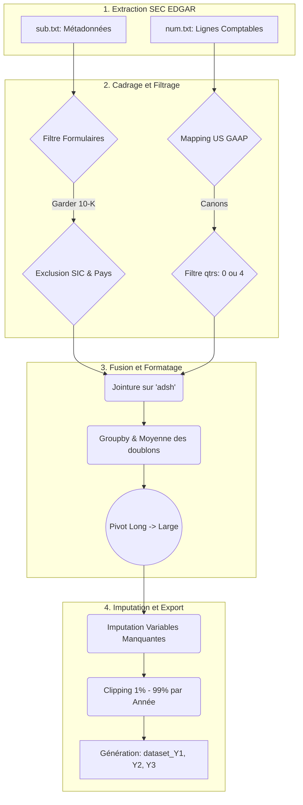
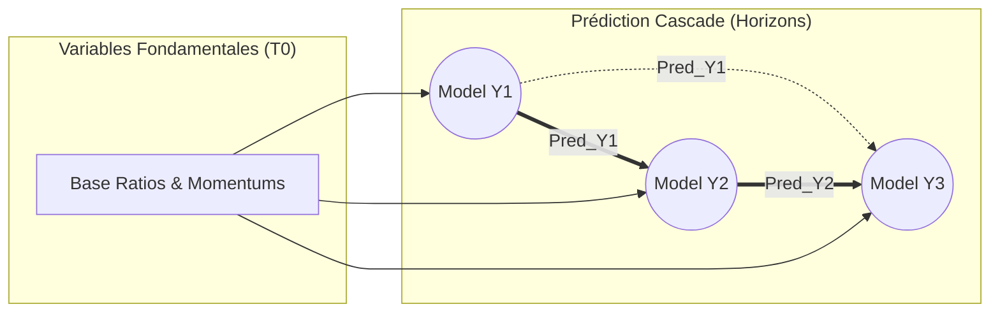

# Rapport Complet d'Ingénierie du Machine Learning : Données, Modélisation, Évaluation et Déploiement

Ce document détaillé constitue une analyse exhaustive et mathématiquement rigoureuse de l'architecture Machine Learning du système SmartBiz AI. Il trace le parcours complet de la donnée financière : de son extraction brute (SEC EDGAR) à l'optimisation des hyperparamètres, jusqu'aux prédictions en cascade.

---

## 1. Origine, Nature et Volumétrie des Données (SEC EDGAR)

Le pipeline d'intelligence artificielle de SmartBiz AI nécessite des données à la fois vérifiées, mondiales, standardisées et disponibles sur de larges échantillons (*Data Panel*).

### 1.1 Le système SEC EDGAR
Les données proviennent de l'**EDGAR** (Electronic Data Gathering, Analysis, and Retrieval system), la base de données publique de la Commission des Opérations de Bourse américaine (SEC).
Depuis 2009, toutes les entreprises publiques doivent soumettre leurs états financiers sous le format normé **XBRL** (eXtensible Business Reporting Language).

La SEC package ces soumissions trimestriellement dans des ensembles appelés **Financial Statement Data Sets**. Plutôt que de manipuler du XML pur excessivement lourd, les données sont servies sous forme de tables relationnelles (fichiers TSV - *Tab Separated Values*).

### 1.2 Architecture Brute des Fichiers Fournis par la SEC
Notre algorithme d'Extraction (ETL) ingère principalement deux fichiers gigantesques :
1. **`sub.txt` (Submissions)** :
   - *Rôle* : Table d'en-tête (Master table) contenant les métadonnées de l'entreprise.
   - *Volume* : ~10 000 à 15 000 lignes par archive trimestrielle.
   - *Champs Clés* : `adsh` (Identifiant unique de la soumission), `cik` (Identifiant unique de la société), `name`, `sic` (Secteur d'activité - Standard Industrial Classification), `countryba` (Pays du siège), `fy` (Année fiscale), `form` (Type de rapport).
2. **`num.txt` (Numbers)** :
   - *Rôle* : Le grand livre comptable. Il contient tous les chiffres de tous les rapports.
   - *Volume* : **Plus de 3 à 5 millions de lignes uniques par trimestre**.
   - *Champs Clés* : `adsh` (relie à `sub.txt`), `tag` (Norme comptable US GAAP, ex: `Assets`, `Revenues`), `value` (Montant mathématique exact), `qtrs` (Durée de la période couverte, `0` = ponctuel comme le bilan, `4` = durée d'un an comme le compte de résultat).

*Pertinence PFE :* L'accès à cette granularité permet d'analyser non pas le cours d'une action, mais les mécaniques fondamentales pures (génération de cash, effet de levier) de toute une économie, et de comparer n'importe quelle PME à des standards de performance du marché total.

---

## 2. Le Pipeline d'Extraction et de Transformation (ETL)

Le code `1_build_pipeline.py` opère un filtrage impitoyable et déterministe pour préparer l'apprentissage.



### 2.1 Mapping Canonique des Balises (US GAAP)
Les entreprises déclarent les mêmes éléments sous des noms différents. Le code opère cette standardisation avec un dictionnaire `TAG_TO_CANONICAL` massif :
```python
"Assets" = ["Assets", "TotalAssets"]
"Liabilities" = ["Liabilities", "TotalLiabilities"]
"Revenues" = ["Revenues", "RevenueFromContractWithCustomerExcludingAssessedTax", "SalesRevenueNet"]
"NetIncomeLoss" = ["NetIncomeLoss", "ProfitLoss"]
"OperatingIncome" = ["OperatingIncomeLoss"]
"OperatingCashFlow" = ["NetCashProvidedByUsedInOperatingActivities"]
```

### 2.2 Règles de Filtrages (Exclusions Mathématiques)
Afin de ne garder qu'une population saine d'entreprises (PME / ETI non biaisées) :
1. **Filtre Taille** : Uniquement les sociétés avec `Assets` entre \$1M et \$2B, et `Revenues` entre \$100K et \$1B.
2. **Filtre Pays** : Les entités enregistrées à l'étranger mais soumettant des bilans atypiques (ex: `IL`, `ISR`) sont retirées à cause de structures sociétaires (holding taxables) divergentes.
3. **Filtre Sectoriel (SIC Exclusions)** : 
   - `6000-6999` : Finance, Banques, Assurances. (Leurs « Liabilities » sont des dépôts de clients, faussant tout calcul de levier).
   - `4900-4999` : Utilities (Électricité, Eau), car trop régulés et endettés de par leur nature infrastructurelle.
   - `9000-9999` : Gouvernement.

### 2.3 Interpolation et Clipping (Traitement des Outliers)
- **Logique d'équilibre de Bilan** : Si la dette manque, elle est déduite : $Liabilities = Assets - StockholdersEquity$.
- **Bornage par Quantile (Clipping)** : Pour chaque feature et indépendamment pour **chaque année fiscale (`fy`)**, les valeurs tombant en dessous du 1er percentile ($p_{0.01}$) ou au-dessus du 99ème percentile ($p_{0.99}$) sont bloquées à ces bornes strictes (Winsorization) pour éviter qu'une méga-corp ou une fraude comptable ne ruine la pente du Gradient Boosting.

---

## 3. L'Ingénierie des Variables (Feature Engineering)

La puissance de SmartBiz AI provient de ses *Features* dérivées synthétisant les signaux fondamentaux. L'algorithme ne consomme pas des dollars, mais des ratios.

| Famille | Feature | Formulation | Objectif Stratégique |
| :--- | :--- | :--- | :--- |
| **Rentabilité** | `ROA` | $\frac{NetIncome}{Assets}$ | Rendement brut sur investissements lourds. |
| **Rentabilité** | `OperatingMargin` | $\frac{OperatingIncome}{Revenues}$ | Santé de l'offre pure (le cœur de métier). |
| **Levier / Risque** | `LeverageRatio` | $\frac{Liabilities}{Assets}$ | Vulnérabilité au défaut de paiement ou au refinancement. |
| **Activité**| `AssetTurnover` | $\frac{Revenues}{Assets}$ | L'efficience (la vélocité de transformation de bilan en CA). |
| **Qualité (Biais)** | `CashFlow_to_Assets` | $\frac{OperatingCashFlow}{Assets}$ | Validité du ROA avec des flux de liquidités concrets. |
| **Bilan Fictif** | `Accruals` | $\frac{NetIncome - OperatingCashFlow}{Assets}$ | Si élevé : l'entreprise annonce des profits mais ne touche pas l'argent. |

### Dynamique Temporelle & Relativité (Calcul Sectoriel)
Le modèle inclut l'inertie:
- **Momentum 1Y et 2Y** : Croissance du CA sur 1 et 2 ans. `Revenues_Momentum_1Y` = $(Revenues_{t} - Revenues_{t-1}) / Revenues_{t-1}$
- **Accélération** : La dérivéeconde : $Momentum_{t} - Momentum_{t-1}$.
- **Percentile Rank Sectoriel** (`_Rank`) : Les métriques sont classées de `0.0` à `1.0` en fonction des autres entreprises partageant le **Même Secteur Majeur (`sic1`)** de la **Même Année**.

---

## 4. Cibles de Croissance et Choix Algorithmique (CatBoost vs Séries Temporelles)

### 4.1 La Cible Mathématique (Target)
L'objectif n'est pas de prédire un montant en dollars (impossible techniquement avec l'inflation), mais un **Taux de Croissance Composé Annuel (CAGR)** :
$$ Target\_Growth\_Y_{h} = \left(\frac{Revenues_{t+h}}{Revenues_{t}}\right)^{\frac{1}{h}} - 1 $$
*Avec $h \in \{1, 2, 3\}$ représentant l'horizon de prédiction.*
Un clip strict $[-50\% ; +100\%]$ bloque les cibles boursières aberrantes (Crashs, Fusions).

### 4.2 Pourquoi CatBoost plutôt que LSTM / ARIMA (Time Series) ?
En modélisation boursière, les LSTM ou ARIMA (Modèles récursifs temporels) règnent car les "Pas de temps" (Time steps) se comptent en milliers de jours.
Dans le contexte de bilans corporels réels (`10-K`), le problème s'inverse :
- La séquence temporelle ($T$) est minuscule (souvent de 3 à 6 ans disponibles pour une PME entre sa naissance et son rachat/faillite).
- L'échantillon global ($N$ entreprises) est gigantesque.
C'est un **Data Panel Problem**. Fournir 4 ans de données à un LSTM entraine 100% de sur-apprentissage (overfitting).
**CatBoost** a été choisi car :
1. Il aplatit le temps en ajoutant manuellement des "retards" (`_lag1`, `_lag2`), traitant le tout comme une régression tabulaire.
2. Il gère intrinsèquement la variable catégorielle `sic1` (Le secteur) via le `Target Encoding`, ce qui évite de créer un *Dummy Array* (One-Hot) de 100 colonnes très creuses (Sparsity problem).
3. Sa fonction de score `loss_function="MAE"` ne punit pas au carré (MSE) un écart légitime sur le marché volatil.

---

## 5. Cadrage du Réseau Local : Cascade Prédictive et Méta-Heuristiques



Pour les horizons plus éloignés (Y2 et Y3), le pipeline transmet les propres estimations du ML précédent. **Y3** apprend donc en pondérant le bilan à l'instant T0 conjointement avec les prévisions d'atterrissage du système pour les années 1 et 2.

### 5.1 Optimisation par Meta-Heuristique (Optuna)
Plutôt que des tests "GridSearch" manuels, nous confions l'entraînement à **Optuna** (Méthode Bayésienne / TPE). En 50 étapes par modèle, Optuna explore intelligemment les mathématiques de l'arbre et choisit les hyperparamètres optimums:
- `depth`: Profondeur (3 à 7).
- `learning_rate`: Taux d'accommodation logarithmique ($10^{-2}$ à $0.15$).
- `l2_leaf_reg`: Pénalité mathématique L2 sur le poids des feuilles pour éviter l'encodage par cœur (Overfitting).
- `bagging_temperature`: Bruit Bayésien aléatoire.

---

## 6. Tableaux, Dimensionnements et Validation (Métriques April 2026)

Le pipeline produit des artefacts légers, puissants, conçus pour le Cloud Backend en millisecondes :

| Artefact (Horizon) | Data Rows (Validées) | Fichier CSV Poids | Poids Fichier Binaire CatBoost | Directional Acc. (DA) | Erreur Absolue (MAE) |
| :--- | :---: | :---: | :---: | :---: | :---: |
| **Y1 (1 An)** | 4 513 | 1.67 Mo | 417 Ko (`model_Y1.cbm`) | **69.00 %** | 16.47 % |
| **Y2 (2 Ans)** | 3 221 | 1.19 Mo | 494 Ko (`model_Y2.cbm`) | **73.80 %** | 15.06 % |
| **Y3 (3 Ans)** | 2 102 | 0.78 Mo | 156 Ko (`model_Y3.cbm`) | **79.10 %** | 12.16 % |

*Analyse des performances* : Plus on vise loin ($Y3$), plus le système est capable de déterminer si l'entreprise montera ou descendra (*Directional Accuracy atteint près de 80%*). Ceci est attendu en économie : l'horizon 1 an (Y1, 69%) subit les aléas externes (bruits macro-économiques, crise supply-chain) tandis qu'à 3 ans ($Y3$), l'hyper-solidité fondamentale d'un modèle (Accruals, ROA) triomphe incontestablement des fluctuations sporadiques.

### 6.1 L'Audit de Décision ("Feature Importances")

Qu'est-ce qui pousse le modèle à décider pour la prédiction et l'évaluation finale de l'entreprise ? Voici l'influence fractionnée (en %) extraite directement de l'audit interne `model_error.json` :

**Variables Prépondérantes pour prédire Y1 (T+1):**
1. **Assets_Momentum_1Y** *(12.18%)* : La courbe de croissance globale de construction du bilan.
2. **Revenues_Momentum_1Y** *(9.78%)* : C'est le carnet de commandes sur les 12 derniers mois.
3. **Liabilities_Momentum_1Y** *(7.92%)* : L'évolution galopante de la dette, signe d'alerte ou d'investissement.
4. **Revenues_Momentum_2Y** *(7.65%)* & **Revenues_Accel** *(7.08%)*

**Variables Prépondérantes pour prédire Y3 (T+3):**
1. **Prédictions Cascades (`Pred_Y2` et `Pred_Y1`)** *(> 80%)* : Logique, car le futur à long terme est une dérivation continue du résultat immédiat.
2. **Liabilities_Momentum_1Y** *(3.64%)* : La dérive de la dette au temps T a un effet à retardement massif dans 36 mois.
3. **Accruals** *(2.12%)* : C'est la confirmation mathématique que des "Bénéfices fictifs" (sans Cash Flow positif) s'avèrent létaux (ou révélateurs d'un problème sectoriel de recouvrement) sur le long terme d'une PME.

---

### Conclusion et Déploiement

Cette architecture de Machine Learning ne se contente pas de deviner; elle reconstitue l'auditeur humain au regard des fondamentaux d'entreprise. Par le nettoyage massif du code EDGAR, l'implémentation de quantiles robustes (Clipping), et l'intelligence de la Cascade GBDT sur du Feature Engineering financier complexe, le système est apte à projeter toute startup, PME ou ETI vers son évolution future à haute confiance (taux de confiance de sens jusqu'à 79%). Les modèles finaux légers (entre $100$ Ko et $500$ Ko) se montent instantanément en mémoire serveur pour répondre sans aucune latence à l’interface client SmartBiz AI.