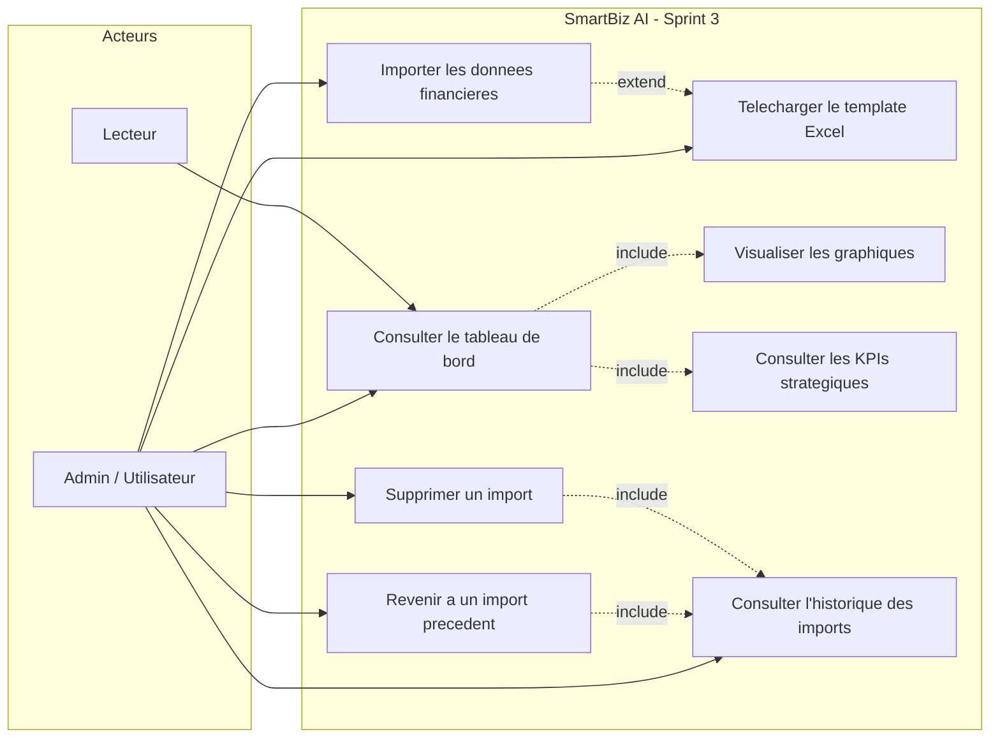
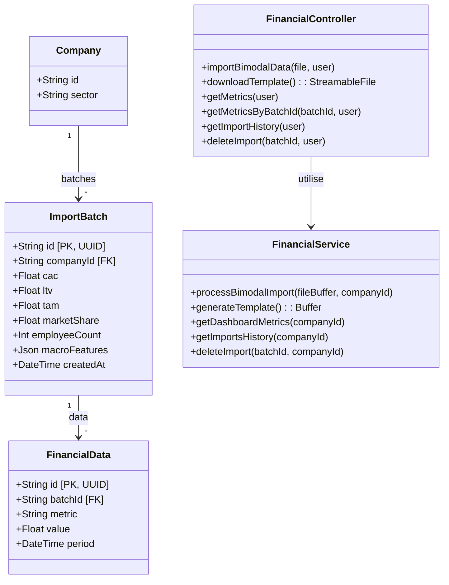
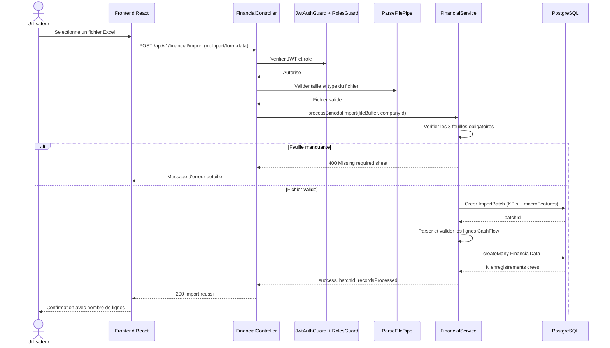
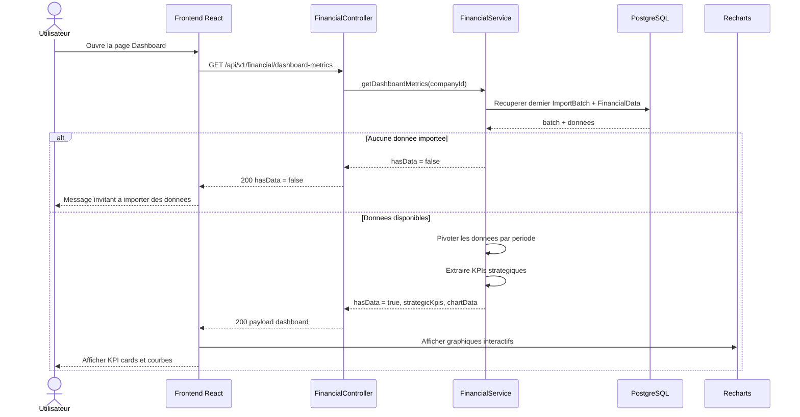
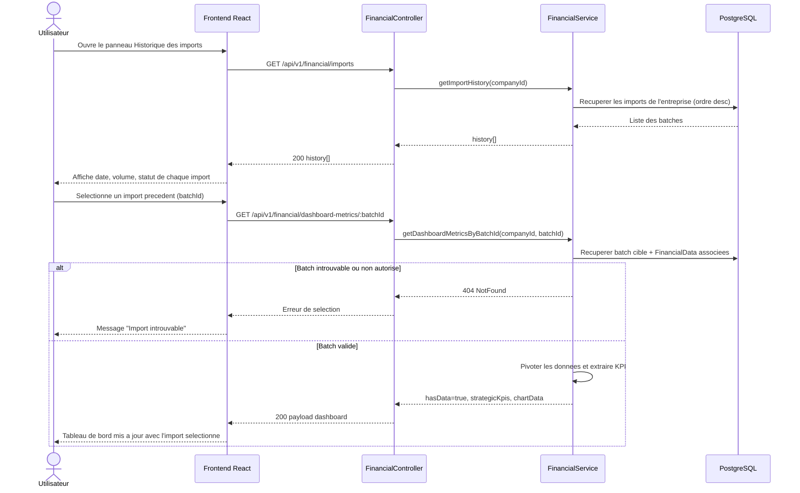
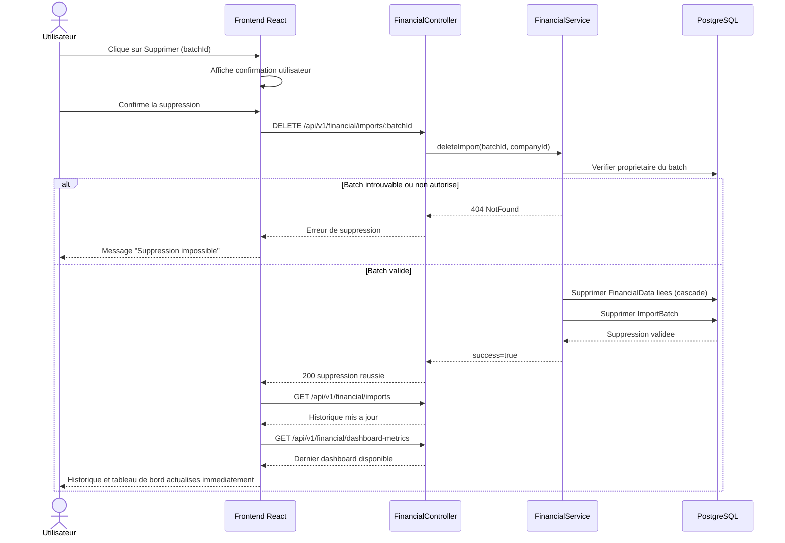

## 3.4.2 Backlog du Sprint 3

Le tableau ci-dessous représente le backlog du Sprint 3.

| ID | User Story | Priorité | Critères d'acceptation |
|---|---|---|---|
| US-04 | En tant qu'utilisateur, je veux importer les données financières de mon entreprise via un fichier Excel structuré. | Haute | Téléversement du fichier Excel, validation des feuilles requises, traitement et stockage des données en base. |
| US-05 | En tant qu'utilisateur, je veux télécharger un template Excel préformaté pour préparer mes données. | Moyenne | Téléchargement d'un fichier contenant les feuilles attendues et les colonnes préremplies. |
| US-06 | En tant qu'utilisateur, je veux visualiser mes données financières dans un tableau de bord interactif. | Haute | Affichage des graphiques des métriques mensuelles, des indicateurs clés et de données organisées par période. |
| US-07 | En tant qu'utilisateur, je veux revenir à un import précédent pour analyser une version antérieure de mes données. | Haute | Consultation de l'historique des imports, sélection d'un import, mise à jour du tableau de bord avec les données sélectionnées. |
| US-08 | En tant qu'utilisateur, je veux supprimer un import erroné ou obsolète. | Moyenne | Suppression sécurisée d'un import et mise à jour immédiate de l'historique et des données affichées. |

Tab. 3.4 : Backlog du Sprint 3

### Complément technique du Sprint 3

| Tâche | Description |
|---|---|
| T-23 | Modéliser les entités d'import (`ImportBatch`, `FinancialData`) et leurs relations avec l'entreprise. |
| T-24 | Implémenter l'API d'import Excel avec validation des feuilles obligatoires. |
| T-25 | Implémenter la génération et le téléchargement du template Excel. |
| T-26 | Implémenter les APIs de récupération des métriques pour le tableau de bord. |
| T-27 | Développer l'interface d'import avec messages de succès/erreur détaillés. |
| T-28 | Développer l'interface du tableau de bord (graphiques + cartes KPI). |
| T-29 | Développer l'interface d'historique des imports (liste, retour à une version, suppression). |
| T-30 | Assurer la synchronisation immédiate entre historique, import actif et tableau de bord. |

## 3.4.3 Analyse du Sprint 3

La figure ci-dessous présente le diagramme de cas d'utilisation du troisième sprint.

Fig. 3.23 : Diagramme de cas d'utilisation - Sprint 3

### Description des scénarios

#### Importer les données financières
1. L'utilisateur accède à la page d'import.
2. Il sélectionne un fichier Excel depuis son ordinateur.
3. Le système vérifie que le fichier est valide et contient les feuilles requises.
4. Les données sont traitées et stockées dans le système.
5. Un message de confirmation indique le nombre de lignes importées avec succès.
6. En cas d'erreur, un message précise la nature du problème.

#### Télécharger le template Excel
1. L'utilisateur clique sur "Télécharger le template".
2. Le système génère un fichier Excel préformaté avec les trois feuilles attendues.
3. Le fichier est téléchargé sur l'ordinateur de l'utilisateur.

#### Consulter le tableau de bord
1. L'utilisateur accède à la page du tableau de bord.
2. Le système récupère les données du dernier import enregistré.
3. Les métriques financières sont affichées sous forme de graphiques interactifs.
4. Les indicateurs clés (CAC, LTV, part de marché, effectifs) apparaissent sous forme de cartes.
5. Si aucune donnée n'a encore été importée, un message invite l'utilisateur à le faire.

#### Revenir à un import précédent
1. L'utilisateur ouvre le panneau d'historique des imports depuis le tableau de bord.
2. La liste de tous les imports précédents s'affiche avec leur date et leur volume.
3. Il sélectionne un import antérieur.
4. Le tableau de bord se met à jour avec les données correspondantes.

#### Supprimer un import
1. L'utilisateur ouvre l'historique des imports.
2. Il clique sur supprimer pour l'import concerné.
3. Le système supprime l'import et toutes les données associées.
4. L'historique et le tableau de bord sont mis à jour automatiquement.

## 3.4.4 Conception du Sprint 3

a- Diagramme de classes du Sprint 3

La figure ci-dessous représente le diagramme de classes du Sprint 3.
La classe `ImportBatch` représente un import avec ses attributs principaux (identifiant, identifiant de l'entreprise, indicateurs clés, données structurées). Elle est liée à une `Company` et peut contenir plusieurs enregistrements de données financières. La classe `FinancialData` regroupe les données de flux de trésorerie (métrique, valeur, période) rattachées à un `ImportBatch`. La classe `FinancialService` orchestre les opérations d'import, de génération du template et de calcul des métriques du tableau de bord.

Fig. 3.24 : Diagramme de classes - Sprint 3

b- Diagrammes de séquence du Sprint 3

La figure 3.25 montre le diagramme de séquence du cas d'utilisation "Importer les données financières".

Fig. 3.25 : Diagramme de séquence - Import des données financières

La figure 3.26 montre le diagramme de séquence du cas d'utilisation "Consulter le tableau de bord".

Fig. 3.26 : Diagramme de séquence - Tableau de bord

La figure 3.26-bis montre le diagramme de séquence du cas d'utilisation "Consulter l'historique, selectionner un import et mettre a jour le tableau de bord".

Fig. 3.26-bis : Diagramme de séquence - Historique des imports et sélection d'une version

La figure 3.26-ter montre le diagramme de séquence du cas d'utilisation "Supprimer un import de maniere securisee et mettre a jour l'historique".

Fig. 3.26-ter : Diagramme de séquence - Suppression sécurisée d'un import

La figure 3.27 montre le diagramme de séquence du cas d'utilisation "Télécharger le template Excel".
[ Fig. 3.27 : Diagramme de séquence - Téléchargement du template ]
Fig. 3.27 : Diagramme de séquence - Téléchargement du template

## 3.4.5 Réalisation du Sprint 3

Nous présentons ci-dessous les principales interfaces réalisées dans le cadre de ce troisième sprint.

Interface d'import de données. La figure 3.28 représente la page d'import avec la zone de sélection du fichier, le bouton de téléchargement du template et le retour visuel après traitement (succès ou erreur avec détails).
[ Fig. 3.28 : Interface d'import de données ]
Fig. 3.28 : Interface d'import de données

Interface du tableau de bord. La figure 3.29 représente la page du tableau de bord avec les graphiques interactifs (revenus, dépenses, flux de trésorerie mensuel) et les indicateurs clés stratégiques.
[ Fig. 3.29 : Interface du tableau de bord ]
Fig. 3.29 : Interface du tableau de bord

Interface de l'historique des imports. La figure 3.30 représente le panneau latéral d'historique affichant la liste des imports avec leur date, les actions de retour à un import précédent et la possibilité de supprimer un import.
[ Fig. 3.30 : Historique des imports ]
Fig. 3.30 : Historique des imports

## 3.5 Conclusion

À ce stade, nous avons terminé et développé avec succès la première release de SmartBiz AI. Cette release a permis de poser des bases solides pour l'ensemble du système : une architecture sécurisée, un module d'authentification complet, des interfaces soignées avec thème clair/sombre et prise en charge de trois langues, un module d'évaluation d'entreprise multi-méthodes, et un tableau de bord interactif alimenté par des données financières importées via Excel.

La gestion de l'historique des imports vient compléter ce tableau de bord en permettant aux utilisateurs d'analyser des versions antérieures de leurs données. La prochaine étape se concentrera sur la deuxième release, qui introduira des fonctionnalités avancées d'intelligence artificielle.
