# Chapitre 3 – Release 1 : Fondations et Modules Principaux

---

## 3.1 Introduction de la Release

La première release de SmartBiz AI couvre les **fondations du système** à travers trois sprints de deux semaines chacun. Elle met en place l'architecture multi-tenant, le module d'authentification sécurisé, les interfaces utilisateur avec gestion des thèmes, de l'internationalisation et des rôles, ainsi que le module d'importation de données financières et le tableau de bord interactif.

| Sprint | Durée | Contenu principal | US |
|---|---|---|---|
| Sprint 1 | 2 sem. | Analyse des besoins, modélisation BDD, architecture multi-tenant, module d'authentification sécurisé | US-01, US-02 |
| Sprint 2 | 2 sem. | Développement des interfaces, thème clair/sombre, changement de langue, système d'invitation et gestion des rôles, formulaire d'évaluation d'entreprise (DCF, multiples) | US-03, US-13, US-09 |
| Sprint 3 | 2 sem. | Module d'import de données Excel, centralisation des informations financières, tableaux de bord interactifs, historique d'import (retour/suppression) | US-04, US-05, US-06, US-07, US-08 |

---

## 3.2 Sprint 1 : Module d'authentification et architecture

### 3.2.1 Objectif

Réaliser l'**analyse des besoins** du système, mettre en place la **modélisation de la base de données** (schéma Prisma) et l'**architecture multi-tenant**, puis développer un **module d'authentification complet et sécurisé** incluant l'inscription avec création d'entreprise, la connexion par JWT (Access + Refresh Token), la vérification d'email, la réinitialisation de mot de passe, et la gestion de profil.

### 3.2.2 Backlog du Sprint 1

| ID | User Story | Priorité | Critères d'acceptation |
|---|---|---|---|
| US-01 | En tant que dirigeant de PME, je veux créer un compte pour mon entreprise avec vérification par email | Haute | Formulaire d'inscription valide, entreprise et utilisateur ADMIN créés, email de vérification envoyé, activation du compte via lien |
| US-02 | En tant qu'utilisateur, je veux me connecter de manière sécurisée et rester connecté via un token rafraîchissable | Haute | Login par email/mot de passe, JWT Access Token (15min), Refresh Token en cookie HttpOnly (7j), endpoint de rafraîchissement, déconnexion |

**Tâches techniques :**

| Tâche | Description |
|---|---|
| T-01 | Conception du schéma Prisma (Company, User, enums UserRole) |
| T-02 | Configuration de l'architecture NestJS multi-modulaire |
| T-03 | Implémentation de l'AuthModule (register, login, verify-email) |
| T-04 | Stratégie JWT avec Passport (JwtStrategy, JwtAuthGuard) |
| T-05 | Service d'envoi d'emails (MailModule, Nodemailer) |
| T-06 | Endpoints : forgot-password, reset-password, change-password |
| T-07 | Pages frontend : Login, Register, ForgotPassword, ResetPassword, EmailVerified |
| T-08 | AuthStore (Zustand) et intercepteur Axios avec refresh automatique |

### 3.2.3 Analyse

#### Diagramme de cas d'utilisation – Sprint 1

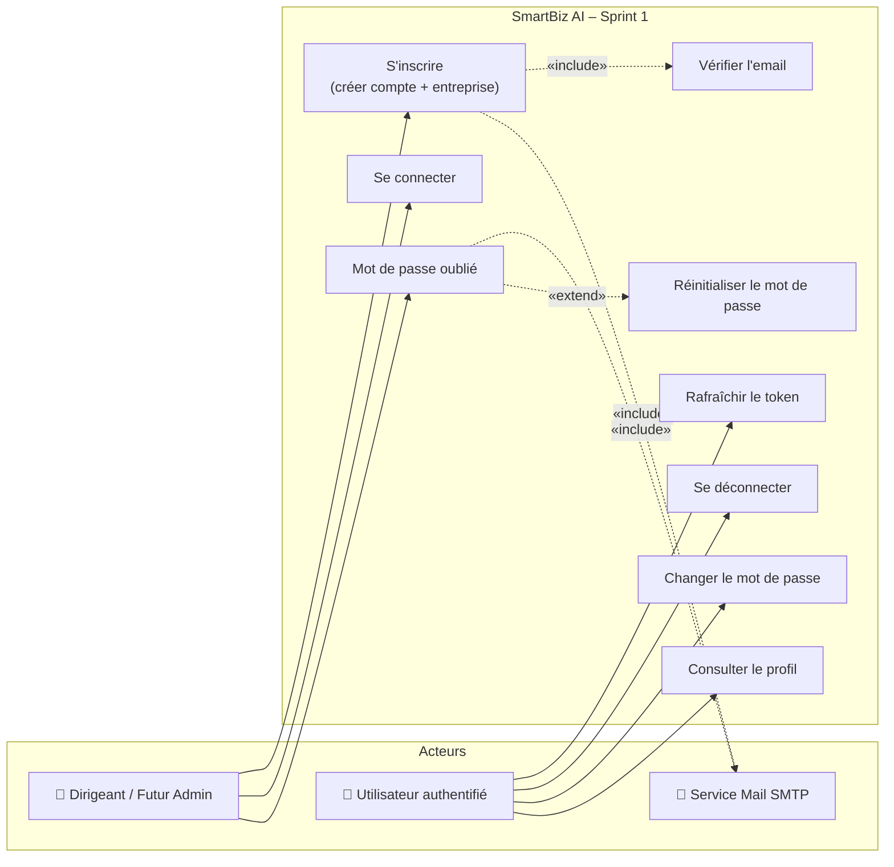
```mermaid
graph LR
    subgraph Acteurs
        DIR["👤 Dirigeant / Futur Admin"]
        USR["👤 Utilisateur authentifié"]
        MAIL["📧 Service Mail SMTP"]
    end

    subgraph "SmartBiz AI – Sprint 1"
        UC1["S'inscrire<br/>(créer compte + entreprise)"]
        UC2["Vérifier l'email"]
        UC3["Se connecter"]
        UC4["Rafraîchir le token"]
        UC5["Se déconnecter"]
        UC6["Mot de passe oublié"]
        UC7["Réinitialiser le mot de passe"]
        UC8["Changer le mot de passe"]
        UC9["Consulter le profil"]
    end

    DIR --> UC1
    DIR --> UC3
    DIR --> UC6
    USR --> UC4 & UC5 & UC8 & UC9
    UC1 -.->|"«include»"| UC2
    UC1 -.->|"«include»"| MAIL
    UC6 -.->|"«include»"| MAIL
    UC6 -.->|"«extend»"| UC7
```

**Figure 3.1** – Diagramme de cas d'utilisation – Sprint 1

#### Description des scénarios

**Cas d'utilisation « S'inscrire »**

| Élément | Description |
|---|---|
| **Acteur principal** | Dirigeant (futur Administrateur) |
| **Acteurs secondaires** | Service Mail (SMTP via Nodemailer/Mailtrap) |
| **Préconditions** | L'utilisateur ne possède pas de compte ; l'email et le matricule fiscal ne sont pas déjà utilisés |
| **Postconditions** | Un `Company` et un `User` (rôle ADMIN) sont créés ; un email de vérification est envoyé |

**Scénario nominal :**
1. L'utilisateur accède à la page `/register`
2. Il saisit : prénom, nom, nom d'entreprise, matricule fiscal, email, mot de passe (≥ 8 caractères)
3. Le frontend valide les données via `react-hook-form` + `zod`
4. Le frontend envoie `POST /api/v1/auth/register` avec le DTO `RegisterDto`
5. Le backend vérifie l'unicité de l'email et du matricule fiscal (`registrationNumber`)
6. Le mot de passe est haché avec `bcrypt` (salt 10 rounds)
7. Le backend crée l'entreprise et l'utilisateur ADMIN dans une même opération Prisma (nested create)
8. Un token de vérification est généré (`crypto.randomBytes(32)`) et sauvegardé
9. L'email de vérification est envoyé via le `MailService`
10. Le backend retourne le message de succès avec les informations de l'entreprise

**Scénarios alternatifs :**
- **5a.** Email déjà utilisé ou matricule fiscal existant → `ConflictException (409)`
- **9a.** Échec SMTP → Le compte est créé mais l'email n'est pas envoyé ; l'utilisateur pourra demander un renvoi

---

**Cas d'utilisation « Se connecter »**

| Élément | Description |
|---|---|
| **Acteur principal** | Utilisateur enregistré |
| **Préconditions** | L'utilisateur possède un compte avec email vérifié |
| **Postconditions** | Un Access Token JWT (15min) est retourné ; un Refresh Token (7j) est stocké en cookie HttpOnly |

**Scénario nominal :**
1. L'utilisateur accède à la page `/login`
2. Il saisit son email et mot de passe
3. Le frontend envoie `POST /api/v1/auth/login` avec le DTO `LoginDto`
4. Le backend recherche l'utilisateur par email
5. Le mot de passe est comparé via `bcrypt.compare()`
6. Le backend vérifie que `isEmailVerified === true`
7. Deux tokens JWT sont générés (Access + Refresh) via `JwtService.signAsync()`
8. Le Refresh Token est haché et sauvegardé en base de données
9. Le controller injecte le Refresh Token dans un cookie (`httpOnly`, `sameSite: strict`, `secure` en production)
10. Le backend évalue la redirection post-login via le `PostLoginService` (onboarding / dashboard)
11. Le frontend stocke l'Access Token dans le `authStore` (Zustand) et `localStorage`

**Scénarios alternatifs :**
- **4a.** Utilisateur introuvable → `UnauthorizedException (401)` « Identifiants invalides »
- **5a.** Mot de passe incorrect → `UnauthorizedException (401)` « Identifiants invalides »
- **6a.** Email non vérifié → `ForbiddenException (403)` « Veuillez vérifier votre email »

---

**Cas d'utilisation « Réinitialiser le mot de passe »**

| Élément | Description |
|---|---|
| **Acteur principal** | Utilisateur ayant oublié son mot de passe |
| **Acteurs secondaires** | Service Mail |
| **Préconditions** | L'utilisateur possède un compte |
| **Postconditions** | Le mot de passe est remplacé par le nouveau mot de passe haché |

**Scénario nominal :**
1. L'utilisateur clique sur « Mot de passe oublié » depuis la page de connexion
2. Il saisit son email → `POST /api/v1/auth/forgot-password`
3. Le backend génère un token de réinitialisation (`crypto.randomBytes(32)`), le hache avec SHA-256, et le sauvegarde avec une expiration de 15 minutes
4. Un email contenant le lien de réinitialisation est envoyé
5. L'utilisateur clique sur le lien → page `/reset-password?token=...`
6. Il saisit son nouveau mot de passe → `POST /api/v1/auth/reset-password`
7. Le backend vérifie le token hashé et son expiration
8. Le nouveau mot de passe est haché et sauvegardé ; le token est supprimé

**Scénarios alternatifs :**
- **2a.** Email inexistant → Le même message est retourné (pas de fuite d'information)
- **7a.** Token expiré ou invalide → `BadRequestException (400)`

---

### 3.2.4 Conception

#### Diagramme de classes – Sprint 1

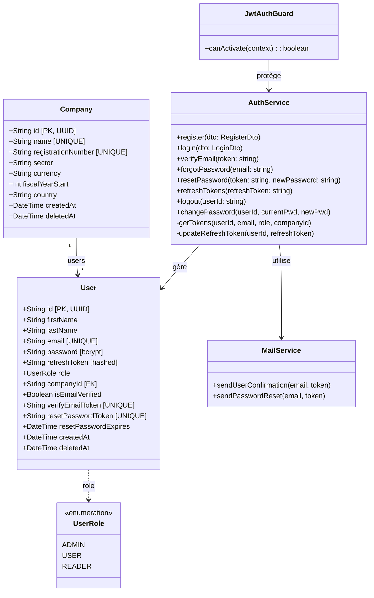
```mermaid
classDiagram
    class Company {
        +String id [PK, UUID]
        +String name [UNIQUE]
        +String registrationNumber [UNIQUE]
        +String sector
        +String currency
        +Int fiscalYearStart
        +String country
        +DateTime createdAt
        +DateTime deletedAt
    }

    class User {
        +String id [PK, UUID]
        +String firstName
        +String lastName
        +String email [UNIQUE]
        +String password [bcrypt]
        +String refreshToken [hashed]
        +UserRole role
        +String companyId [FK]
        +Boolean isEmailVerified
        +String verifyEmailToken [UNIQUE]
        +String resetPasswordToken [UNIQUE]
        +DateTime resetPasswordExpires
        +DateTime createdAt
        +DateTime deletedAt
    }

    class UserRole {
        <<enumeration>>
        ADMIN
        USER
        READER
    }

    class AuthService {
        +register(dto: RegisterDto)
        +login(dto: LoginDto)
        +verifyEmail(token: string)
        +forgotPassword(email: string)
        +resetPassword(token: string, newPassword: string)
        +refreshTokens(refreshToken: string)
        +logout(userId: string)
        +changePassword(userId, currentPwd, newPwd)
        -getTokens(userId, email, role, companyId)
        -updateRefreshToken(userId, refreshToken)
    }

    class JwtAuthGuard {
        +canActivate(context): boolean
    }

    class MailService {
        +sendUserConfirmation(email, token)
        +sendPasswordReset(email, token)
    }

    Company "1" --> "*" User : users
    User ..> UserRole : role
    AuthService --> User : gère
    AuthService --> MailService : utilise
    JwtAuthGuard --> AuthService : protège
```

**Figure 3.2** – Diagramme de classes – Sprint 1

#### Diagramme de séquence – Inscription

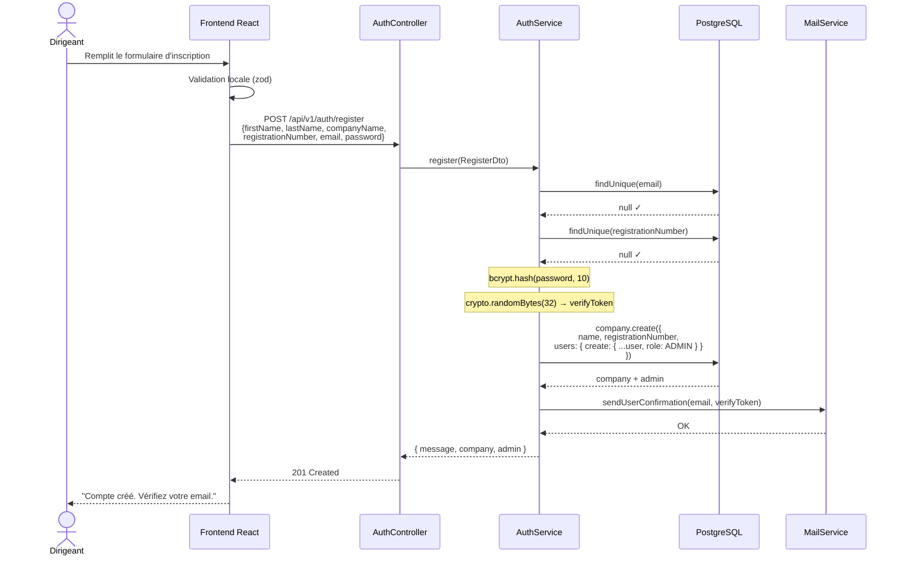
```mermaid
sequenceDiagram
    actor U as Dirigeant
    participant F as Frontend React
    participant B as AuthController
    participant S as AuthService
    participant DB as PostgreSQL
    participant M as MailService

    U->>F: Remplit le formulaire d'inscription
    F->>F: Validation locale (zod)
    F->>B: POST /api/v1/auth/register<br/>{firstName, lastName, companyName,<br/>registrationNumber, email, password}

    B->>S: register(RegisterDto)
    S->>DB: findUnique(email)
    DB-->>S: null ✓
    S->>DB: findUnique(registrationNumber)
    DB-->>S: null ✓

    Note over S: bcrypt.hash(password, 10)
    Note over S: crypto.randomBytes(32) → verifyToken

    S->>DB: company.create({<br/>  name, registrationNumber,<br/>  users: { create: { ...user, role: ADMIN } }<br/>})
    DB-->>S: company + admin

    S->>M: sendUserConfirmation(email, verifyToken)
    M-->>S: OK

    S-->>B: { message, company, admin }
    B-->>F: 201 Created
    F-->>U: "Compte créé. Vérifiez votre email."
```

**Figure 3.3** – Diagramme de séquence – Inscription

#### Diagramme de séquence – Connexion

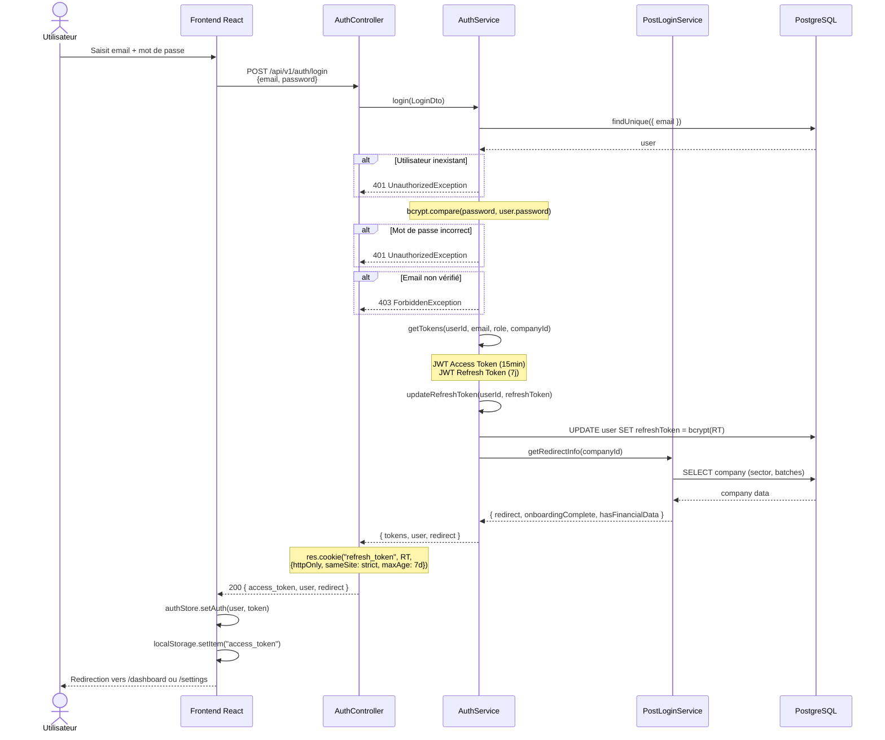
```mermaid
sequenceDiagram
    actor U as Utilisateur
    participant F as Frontend React
    participant B as AuthController
    participant S as AuthService
    participant PL as PostLoginService
    participant DB as PostgreSQL

    U->>F: Saisit email + mot de passe
    F->>B: POST /api/v1/auth/login<br/>{email, password}

    B->>S: login(LoginDto)
    S->>DB: findUnique({ email })
    DB-->>S: user

    alt Utilisateur inexistant
        S-->>B: 401 UnauthorizedException
    end

    Note over S: bcrypt.compare(password, user.password)

    alt Mot de passe incorrect
        S-->>B: 401 UnauthorizedException
    end

    alt Email non vérifié
        S-->>B: 403 ForbiddenException
    end

    S->>S: getTokens(userId, email, role, companyId)
    Note over S: JWT Access Token (15min)<br/>JWT Refresh Token (7j)

    S->>S: updateRefreshToken(userId, refreshToken)
    S->>DB: UPDATE user SET refreshToken = bcrypt(RT)
    
    S->>PL: getRedirectInfo(companyId)
    PL->>DB: SELECT company (sector, batches)
    DB-->>PL: company data
    PL-->>S: { redirect, onboardingComplete, hasFinancialData }

    S-->>B: { tokens, user, redirect }

    Note over B: res.cookie("refresh_token", RT,<br/>{httpOnly, sameSite: strict, maxAge: 7d})

    B-->>F: 200 { access_token, user, redirect }
    F->>F: authStore.setAuth(user, token)
    F->>F: localStorage.setItem("access_token")
    F-->>U: Redirection vers /dashboard ou /settings
```

**Figure 3.4** – Diagramme de séquence – Connexion

#### Diagramme de séquence – Réinitialisation de mot de passe

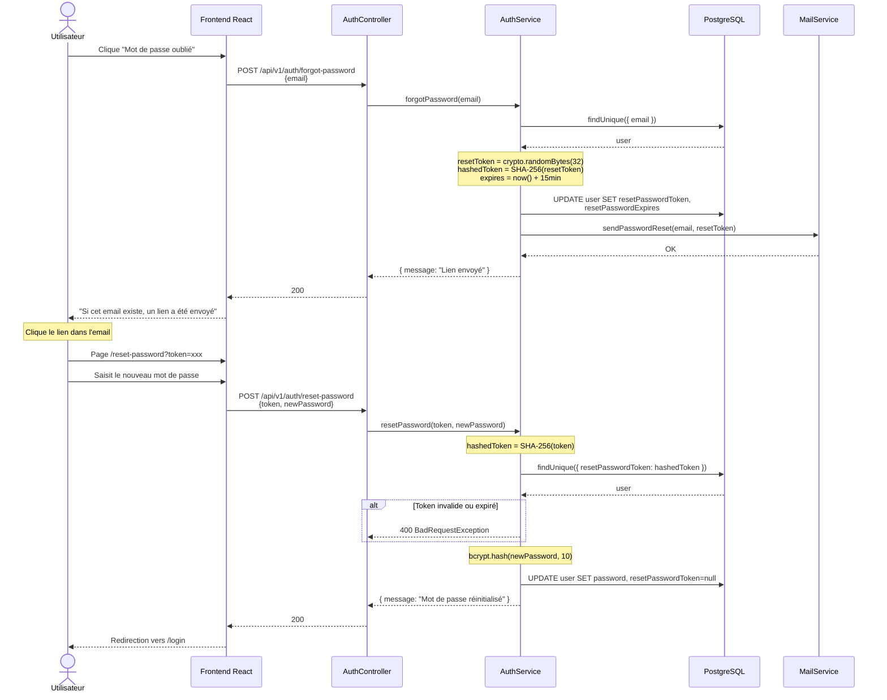
```mermaid
sequenceDiagram
    actor U as Utilisateur
    participant F as Frontend React
    participant B as AuthController
    participant S as AuthService
    participant DB as PostgreSQL
    participant M as MailService

    U->>F: Clique "Mot de passe oublié"
    F->>B: POST /api/v1/auth/forgot-password<br/>{email}
    B->>S: forgotPassword(email)
    S->>DB: findUnique({ email })
    DB-->>S: user

    Note over S: resetToken = crypto.randomBytes(32)<br/>hashedToken = SHA-256(resetToken)<br/>expires = now() + 15min

    S->>DB: UPDATE user SET resetPasswordToken,<br/>resetPasswordExpires
    S->>M: sendPasswordReset(email, resetToken)
    M-->>S: OK
    S-->>B: { message: "Lien envoyé" }
    B-->>F: 200
    F-->>U: "Si cet email existe, un lien a été envoyé"

    Note over U: Clique le lien dans l'email

    U->>F: Page /reset-password?token=xxx
    U->>F: Saisit le nouveau mot de passe
    F->>B: POST /api/v1/auth/reset-password<br/>{token, newPassword}
    B->>S: resetPassword(token, newPassword)
    
    Note over S: hashedToken = SHA-256(token)
    S->>DB: findUnique({ resetPasswordToken: hashedToken })
    DB-->>S: user

    alt Token invalide ou expiré
        S-->>B: 400 BadRequestException
    end

    Note over S: bcrypt.hash(newPassword, 10)
    S->>DB: UPDATE user SET password, resetPasswordToken=null
    S-->>B: { message: "Mot de passe réinitialisé" }
    B-->>F: 200
    F-->>U: Redirection vers /login
```

**Figure 3.5** – Diagramme de séquence – Réinitialisation de mot de passe

### 3.2.5 Réalisation

> [!NOTE]
> Les captures d'écran des interfaces réalisées pour le Sprint 1 (Login, Register, ForgotPassword, ResetPassword, EmailVerified) sont à insérer ici.

**Interfaces développées :**
- **Page Login** (`/login`) — Formulaire de connexion avec validation email/mot de passe
- **Page Register** (`/register`) — Formulaire d'inscription avec champs entreprise et utilisateur
- **Page ForgotPassword** (`/forgot-password`) — Saisie de l'email pour la réinitialisation
- **Page ResetPassword** (`/reset-password`) — Saisie du nouveau mot de passe via le lien reçu
- **Page EmailVerified** (`/email-verified`) — Confirmation de la vérification de l'email (succès/erreur)

---

## 3.3 Sprint 2 : Interfaces, thème, internationalisation et gestion des rôles

### 3.3.1 Objectif

Développer les **interfaces principales de l'application** (layout, navigation, sidebar), implémenter le **système de thème clair/sombre** persistant, mettre en place le **changement de langue** (français, anglais, arabe avec support RTL), développer le **système d'invitation de membres** avec gestion des rôles (USER, READER), et intégrer un **formulaire d'évaluation d'entreprise** interactif supportant plusieurs méthodes (DCF / Gordon Growth, multiples d'EBITDA, etc.).

### 3.3.2 Backlog du Sprint 2

| ID | User Story | Priorité | Critères d'acceptation |
|---|---|---|---|
| US-03 | En tant qu'administrateur, je veux inviter des membres de mon équipe avec des rôles différents (USER, READER) | Haute | Envoi d'invitation par email, choix du rôle, lien d'acceptation, activation du compte via le lien, liste des membres, suppression soft delete |
| US-13 | En tant qu'utilisateur, je veux basculer entre le thème clair et sombre et changer la langue de l'interface | Basse | Toggle de thème dans la topbar, persistance dans localStorage, sélecteur de langue (FR / EN / العربية) avec support RTL, application via classe CSS `dark` |
| US-09 | En tant qu'utilisateur, je veux un formulaire pour évaluer mon entreprise selon plusieurs méthodes (multiples, DCF) | Haute | Formulaire interactif, calcul en temps réel de la valeur d'entreprise/capitaux propres, explication de la formule, sauvegarde de l'historique de valorisation |

**Tâches techniques :**

| Tâche | Description |
|---|---|
| T-09 | Layout principal : Sidebar, Topbar, contenu central |
| T-10 | RolesGuard (vérification des rôles via Reflector + décorateur `@Roles`) |
| T-11 | Endpoints invitation : `POST /auth/invite`, `POST /auth/accept-invite` |
| T-12 | Endpoints gestion d'équipe : `GET /auth/team`, `DELETE /auth/team/:id` |
| T-13 | Pages frontend : Team, AcceptInvite, Settings (section profil) |
| T-14 | ThemeStore (Zustand) avec `toggleTheme()` et persistance `localStorage` |
| T-15 | Configuration TailwindCSS v4 dark mode (class-based) |
| T-16 | Composant Topbar avec toggle de thème, sélecteur de langue et indicateur utilisateur |
| T-17 | Configuration i18next + react-i18next + LanguageDetector |
| T-18 | Fichiers de traduction : `fr.json`, `en.json`, `ar.json` (3 langues) |
| T-19 | Support RTL automatique pour l'arabe (`document.documentElement.dir`) |
| T-20 | Implémentation du module backend `ValuationModule` (méthodes EV/EBITDA, DCF) |
| T-21 | Endpoints évaluation : `POST /valuation/calculate`, `POST /valuation/save`, `GET /history` |
| T-22 | Page frontend `ValuationPage` et store Zustand pour la valorisation interactive |

### 3.3.3 Analyse

#### Diagramme de cas d'utilisation – Sprint 2

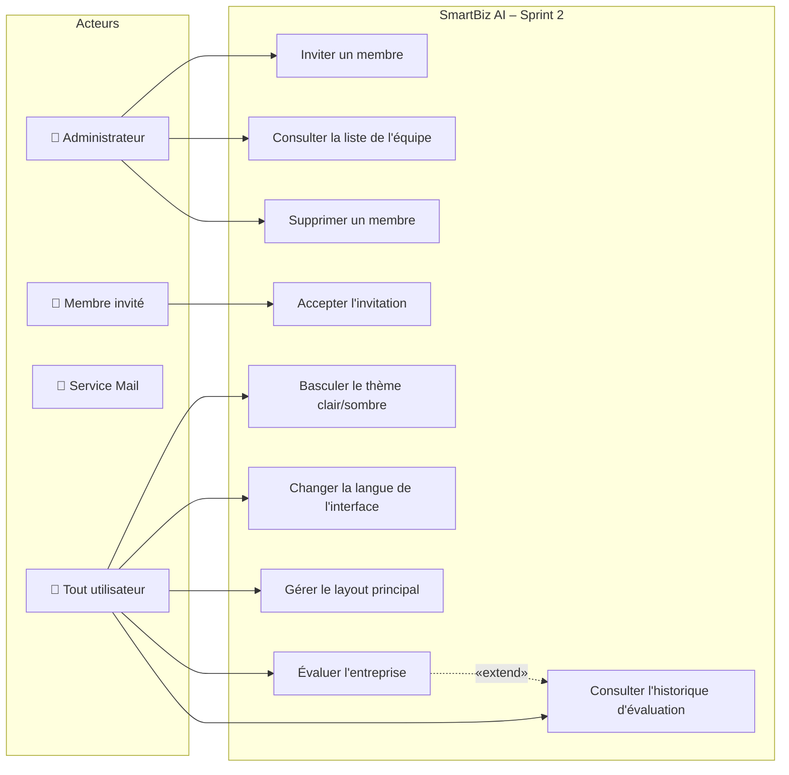
```mermaid
graph LR
    subgraph Acteurs
        ADMIN["👤 Administrateur"]
        INVIT["👤 Membre invité"]
        MAIL["📧 Service Mail"]
        ALL["👤 Tout utilisateur"]
    end

    subgraph "SmartBiz AI – Sprint 2"
        UC1["Inviter un membre"]
        UC2["Accepter l'invitation"]
        UC3["Consulter la liste de l'équipe"]
        UC4["Supprimer un membre"]
        UC5["Basculer le thème clair/sombre"]
        UC6["Changer la langue de l'interface"]
        UC7["Gérer le layout principal"]
        UC8["Évaluer l'entreprise"]
        UC9["Consulter l'historique d'évaluation"]
    end

    ADMIN --> UC1 & UC3 & UC4
    INVIT --> UC2
    ALL --> UC5 & UC6 & UC7 & UC8 & UC9
    UC8 -.->|"«extend»"| UC9
```

**Figure 3.6** – Diagramme de cas d'utilisation – Sprint 2

#### Description des scénarios

**Cas d'utilisation « Inviter un membre »**

| Élément | Description |
|---|---|
| **Acteur principal** | Administrateur |
| **Acteurs secondaires** | Service Mail (SMTP) |
| **Préconditions** | L'utilisateur est authentifié avec le rôle `ADMIN` |
| **Postconditions** | Un utilisateur pré-enregistré est créé avec un token d'invitation (7j) ; un email est envoyé |

**Scénario nominal :**
1. L'administrateur accède à la page `/team`
2. Il clique sur « Inviter un membre »
3. Il saisit l'email du nouveau membre et sélectionne le rôle (`USER` ou `READER`)
4. Le frontend envoie `POST /api/v1/auth/invite` avec `{email, role}` (protégé par `JwtAuthGuard` + `RolesGuard(ADMIN)`)
5. Le backend vérifie que l'admin est bien `ADMIN` et récupère son entreprise
6. Le backend vérifie que l'email n'est pas déjà associé à un compte
7. Un token d'invitation est généré et haché (SHA-256), avec expiration de 7 jours
8. Un utilisateur « En attente » est créé avec un mot de passe temporaire aléatoire
9. L'email d'invitation est envoyé via `MailService.sendTeamInvite()`
10. Le système confirme « Invitation envoyée avec succès »

**Scénarios alternatifs :**
- **4a.** Utilisateur non ADMIN → `ForbiddenException (403)`
- **6a.** Email déjà utilisé → `BadRequestException (400)` « Cet utilisateur existe déjà »
- **9a.** Échec SMTP → L'utilisateur est créé mais ne reçoit pas l'email

---

**Cas d'utilisation « Accepter l'invitation »**

| Élément | Description |
|---|---|
| **Acteur principal** | Membre invité |
| **Préconditions** | L'utilisateur a reçu un lien d'invitation avec un token valide (non expiré) |
| **Postconditions** | Le compte est activé avec les informations complètes ; `isEmailVerified = true` |

**Scénario nominal :**
1. Le membre invité clique sur le lien reçu par email → `/accept-invite?token=...`
2. Il saisit son prénom, nom et nouveau mot de passe
3. Le frontend envoie `POST /api/v1/auth/accept-invite` avec `{token, password, firstName, lastName}`
4. Le backend hache le token et recherche l'utilisateur correspondant
5. Le backend vérifie que le token n'est pas expiré
6. Le mot de passe est haché avec bcrypt, les informations sont mises à jour
7. Le token d'invitation est supprimé et `isEmailVerified` passe à `true`
8. Le membre peut désormais se connecter

**Scénarios alternatifs :**
- **4a.** Token invalide → `BadRequestException (400)` « Lien invalide ou expiré »
- **5a.** Token expiré → `BadRequestException (400)`

---

**Cas d'utilisation « Basculer le thème »**

| Élément | Description |
|---|---|
| **Acteur principal** | Tout utilisateur authentifié |
| **Préconditions** | L'utilisateur est sur l'application |
| **Postconditions** | Le thème est changé visuellement et persisté dans `localStorage` |

**Scénario nominal :**
1. L'utilisateur clique sur l'icône de thème dans la Topbar
2. Le `ThemeStore` exécute `toggleTheme()` : `light → dark` ou `dark → light`
3. Le thème est sauvegardé dans `localStorage.setItem('theme')`
4. La fonction `applyTheme()` ajoute/retire la classe CSS `dark` sur `document.documentElement`
5. TailwindCSS applique les styles du thème sombre via les variantes `dark:`

**Scénarios alternatifs :**
- **1a.** Premier accès → Le thème par défaut est `light` ; si `system` est configuré, le media query `prefers-color-scheme` est consulté

---

**Cas d'utilisation « Changer la langue de l'interface »**

| Élément | Description |
|---|---|
| **Acteur principal** | Tout utilisateur authentifié |
| **Préconditions** | L'utilisateur est sur l'application |
| **Postconditions** | La langue de l'interface est changée ; la direction du texte (LTR/RTL) est adaptée |

**Scénario nominal :**
1. L'utilisateur clique sur le sélecteur de langue (icône 🌐 Globe) dans la Topbar
2. Il sélectionne une langue parmi : Français (FR), Anglais (EN), Arabe (العربية)
3. La fonction `i18n.changeLanguage(lng)` est appelée
4. Le `LanguageDetector` persiste la préférence dans le navigateur
5. Toutes les clés de traduction sont mises à jour instantanément (via `react-i18next`)
6. L'événement `languageChanged` met à jour la direction du texte : `document.documentElement.dir = lng === 'ar' ? 'rtl' : 'ltr'`
7. L'attribut `lang` du document HTML est mis à jour

**Scénarios alternatifs :**
- **1a.** Premier accès → Le `LanguageDetector` détecte la langue du navigateur ; langue par défaut : `fr` (fallback)
- **2a.** Sélection de l'arabe → L'ensemble de l'interface passe en RTL (droite à gauche)

---

**Cas d'utilisation « Évaluer l'entreprise »**

| Élément | Description |
|---|---|
| **Acteur principal** | Utilisateur (tous rôles) |
| **Préconditions** | L'utilisateur est authentifié |
| **Postconditions** | Les métriques financières de valorisation sont calculées ; un enregistrement `SavedValuation` peut être créé |

**Scénario nominal :**
1. L'utilisateur accède à la page `/valuation`
2. Il choisit une méthode d'évaluation (ex. *EV / EBITDA*) parmi celles retournées par `GET /valuation/methods`
3. Il saisit les variables requises (EBITDA, Multiple, Net Debt)
4. Dès modification, le frontend appelle `POST /api/v1/valuation/calculate`
5. Le `ValuationService` calcule l'Enterprise Value (`EV = EBITDA × Multiple`) et l'Equity Value (`Equity = EV - Net Debt`)
6. Le backend retourne les résultats, la formule détaillée et l'explication
7. Le frontend affiche dynamiquement la formule, l'explication textuelle et les résultats finaux
8. L'utilisateur décide de sauvegarder cette simulation en cliquant sur "Sauvegarder"
9. Le frontend envoie `POST /api/v1/valuation/save` ; l'enregistrement est lié à la `Company`

**Scénarios alternatifs :**
- **3a.** Champs manquants ou invalides → Le bouton "Sauvegarder" est désactivé
- **5a.** Incohérence mathématique (ex. WACC ≤ Growth Rate dans DCF) → Erreur `400 BadRequestException`

---

### 3.3.4 Conception

#### Diagramme de classes – Sprint 2

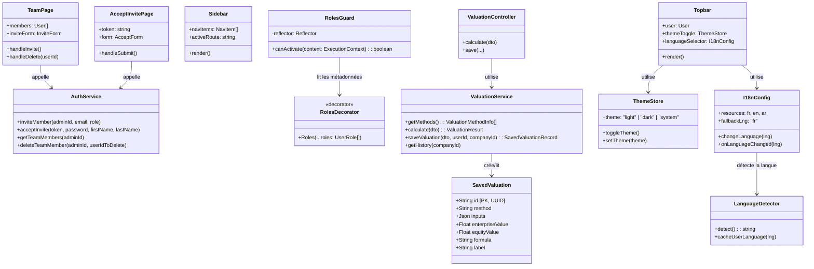
```mermaid
classDiagram
    class AuthService {
        +inviteMember(adminId, email, role)
        +acceptInvite(token, password, firstName, lastName)
        +getTeamMembers(adminId)
        +deleteTeamMember(adminId, userIdToDelete)
    }

    class RolesGuard {
        -reflector: Reflector
        +canActivate(context: ExecutionContext): boolean
    }

    class RolesDecorator {
        <<decorator>>
        +Roles(...roles: UserRole[])
    }

    class ThemeStore {
        +theme: "light" | "dark" | "system"
        +toggleTheme()
        +setTheme(theme)
    }

    class ValuationService {
        +getMethods(): ValuationMethodInfo[]
        +calculate(dto): ValuationResult
        +saveValuation(dto, userId, companyId): SavedValuationRecord
        +getHistory(companyId)
    }

    class SavedValuation {
        +String id [PK, UUID]
        +String method
        +Json inputs
        +Float enterpriseValue
        +Float equityValue
        +String formula
        +String label
    }

    class I18nConfig {
        +resources: fr, en, ar
        +fallbackLng: "fr"
        +changeLanguage(lng)
        +onLanguageChanged(lng)
    }

    class LanguageDetector {
        +detect(): string
        +cacheUserLanguage(lng)
    }

    class ValuationController {
        +calculate(dto)
        +save(...)
    }

    class Sidebar {
        +navItems: NavItem[]
        +activeRoute: string
        +render()
    }

    class Topbar {
        +user: User
        +themeToggle: ThemeStore
        +languageSelector: I18nConfig
        +render()
    }

    class TeamPage {
        +members: User[]
        +inviteForm: InviteForm
        +handleInvite()
        +handleDelete(userId)
    }

    class AcceptInvitePage {
        +token: string
        +form: AcceptForm
        +handleSubmit()
    }

    RolesGuard --> RolesDecorator : lit les métadonnées
    Topbar --> ThemeStore : utilise
    Topbar --> I18nConfig : utilise
    I18nConfig --> LanguageDetector : détecte la langue
    TeamPage --> AuthService : appelle
    AcceptInvitePage --> AuthService : appelle
    ValuationController --> ValuationService : utilise
    ValuationService --> SavedValuation : crée/lit
```

**Figure 3.7** – Diagramme de classes – Sprint 2

#### Diagramme de séquence – Inviter un membre

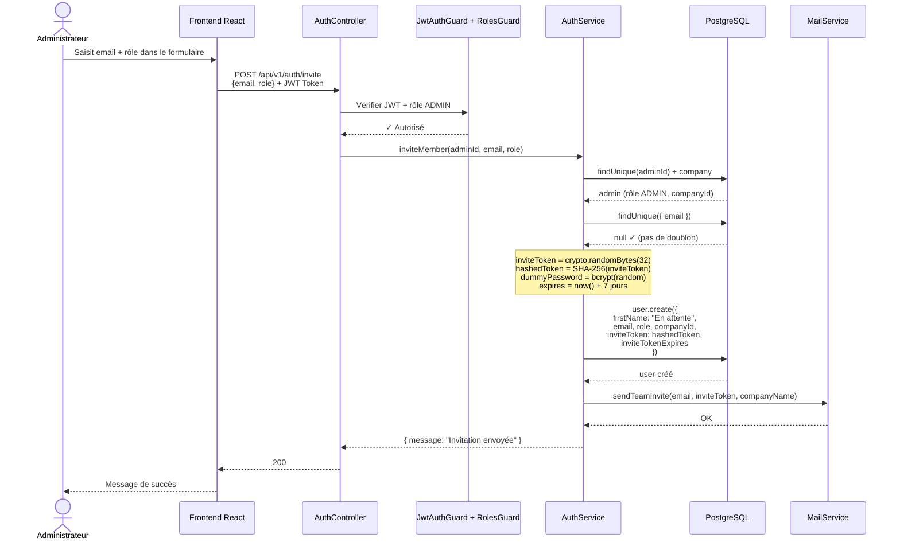
```mermaid
sequenceDiagram
    actor A as Administrateur
    participant F as Frontend React
    participant B as AuthController
    participant G as JwtAuthGuard + RolesGuard
    participant S as AuthService
    participant DB as PostgreSQL
    participant M as MailService

    A->>F: Saisit email + rôle dans le formulaire
    F->>B: POST /api/v1/auth/invite<br/>{email, role} + JWT Token

    B->>G: Vérifier JWT + rôle ADMIN
    G-->>B: ✓ Autorisé

    B->>S: inviteMember(adminId, email, role)
    
    S->>DB: findUnique(adminId) + company
    DB-->>S: admin (rôle ADMIN, companyId)
    
    S->>DB: findUnique({ email })
    DB-->>S: null ✓ (pas de doublon)

    Note over S: inviteToken = crypto.randomBytes(32)<br/>hashedToken = SHA-256(inviteToken)<br/>dummyPassword = bcrypt(random)<br/>expires = now() + 7 jours

    S->>DB: user.create({<br/>  firstName: "En attente",<br/>  email, role, companyId,<br/>  inviteToken: hashedToken,<br/>  inviteTokenExpires<br/>})
    DB-->>S: user créé

    S->>M: sendTeamInvite(email, inviteToken, companyName)
    M-->>S: OK

    S-->>B: { message: "Invitation envoyée" }
    B-->>F: 200
    F-->>A: Message de succès
```

**Figure 3.8** – Diagramme de séquence – Inviter un membre

#### Diagramme de séquence – Accepter l'invitation

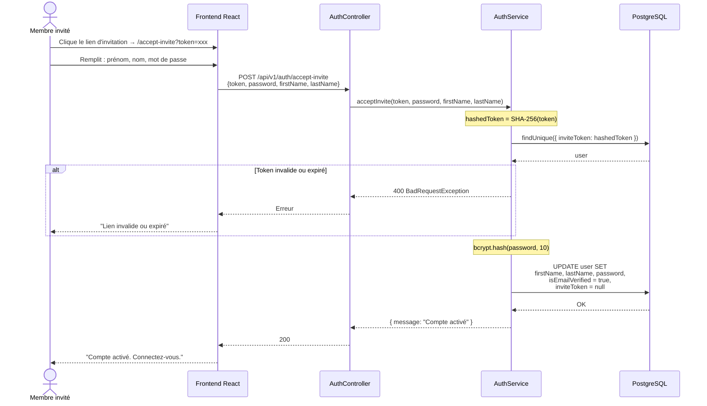
```mermaid
sequenceDiagram
    actor I as Membre invité
    participant F as Frontend React
    participant B as AuthController
    participant S as AuthService
    participant DB as PostgreSQL

    I->>F: Clique le lien d'invitation → /accept-invite?token=xxx
    I->>F: Remplit : prénom, nom, mot de passe
    F->>B: POST /api/v1/auth/accept-invite<br/>{token, password, firstName, lastName}

    B->>S: acceptInvite(token, password, firstName, lastName)

    Note over S: hashedToken = SHA-256(token)
    S->>DB: findUnique({ inviteToken: hashedToken })
    DB-->>S: user

    alt Token invalide ou expiré
        S-->>B: 400 BadRequestException
        B-->>F: Erreur
        F-->>I: "Lien invalide ou expiré"
    end

    Note over S: bcrypt.hash(password, 10)

    S->>DB: UPDATE user SET<br/>firstName, lastName, password,<br/>isEmailVerified = true,<br/>inviteToken = null
    DB-->>S: OK

    S-->>B: { message: "Compte activé" }
    B-->>F: 200
    F-->>I: "Compte activé. Connectez-vous."
```

**Figure 3.9** – Diagramme de séquence – Accepter l'invitation

#### Diagramme de séquence – Basculer le thème

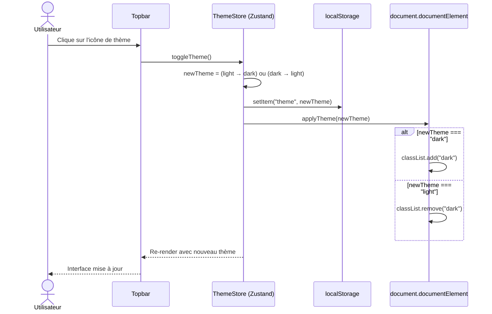
```mermaid
sequenceDiagram
    actor U as Utilisateur
    participant T as Topbar
    participant TS as ThemeStore (Zustand)
    participant LS as localStorage
    participant DOM as document.documentElement

    U->>T: Clique sur l'icône de thème
    T->>TS: toggleTheme()
    TS->>TS: newTheme = (light → dark) ou (dark → light)
    TS->>LS: setItem("theme", newTheme)
    TS->>DOM: applyTheme(newTheme)
    
    alt newTheme === "dark"
        DOM->>DOM: classList.add("dark")
    else newTheme === "light"
        DOM->>DOM: classList.remove("dark")
    end

    TS-->>T: Re-render avec nouveau thème
    T-->>U: Interface mise à jour
```

**Figure 3.10** – Diagramme de séquence – Basculer le thème

#### Diagramme de séquence – Changer la langue

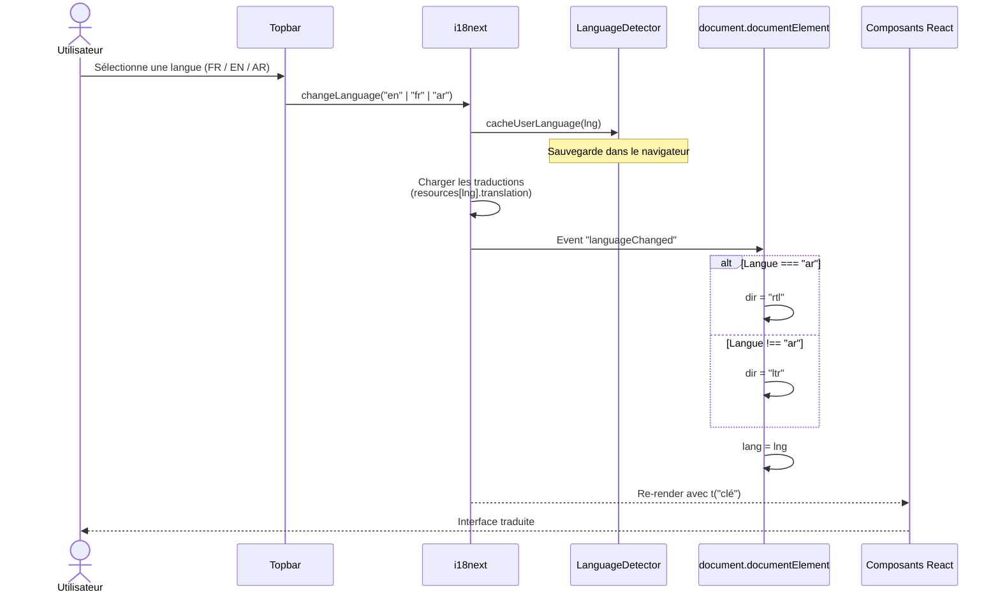
```mermaid
sequenceDiagram
    actor U as Utilisateur
    participant T as Topbar
    participant I18N as i18next
    participant LD as LanguageDetector
    participant DOM as document.documentElement
    participant UI as Composants React

    U->>T: Sélectionne une langue (FR / EN / AR)
    T->>I18N: changeLanguage("en" | "fr" | "ar")
    I18N->>LD: cacheUserLanguage(lng)
    Note over LD: Sauvegarde dans le navigateur

    I18N->>I18N: Charger les traductions<br/>(resources[lng].translation)

    I18N->>DOM: Event "languageChanged"
    
    alt Langue === "ar"
        DOM->>DOM: dir = "rtl"
    else Langue !== "ar"
        DOM->>DOM: dir = "ltr"
    end
    
    DOM->>DOM: lang = lng

    I18N-->>UI: Re-render avec t("clé")
    UI-->>U: Interface traduite
```

**Figure 3.11** – Diagramme de séquence – Changer la langue

#### Diagramme de séquence – Évaluer l'entreprise

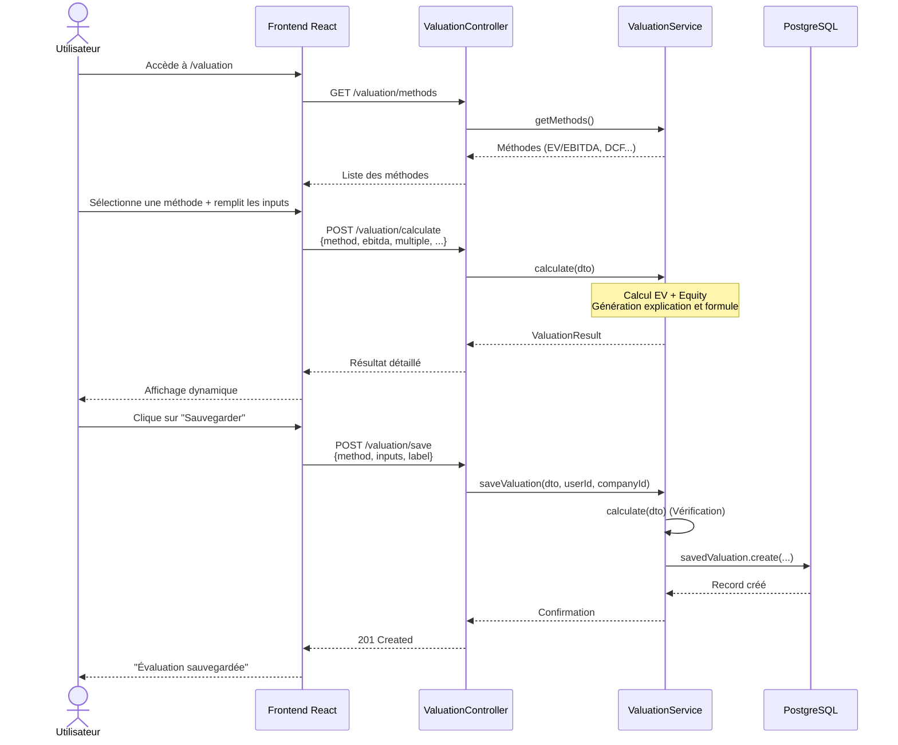
```mermaid
sequenceDiagram
    actor U as Utilisateur
    participant F as Frontend React
    participant C as ValuationController
    participant S as ValuationService
    participant DB as PostgreSQL

    U->>F: Accède à /valuation
    F->>C: GET /valuation/methods
    C->>S: getMethods()
    S-->>C: Méthodes (EV/EBITDA, DCF...)
    C-->>F: Liste des méthodes
    
    U->>F: Sélectionne une méthode + remplit les inputs
    F->>C: POST /valuation/calculate<br/>{method, ebitda, multiple, ...}
    C->>S: calculate(dto)
    Note over S: Calcul EV + Equity<br/>Génération explication et formule
    S-->>C: ValuationResult
    C-->>F: Résultat détaillé
    F-->>U: Affichage dynamique
    
    U->>F: Clique sur "Sauvegarder"
    F->>C: POST /valuation/save<br/>{method, inputs, label}
    C->>S: saveValuation(dto, userId, companyId)
    S->>S: calculate(dto) (Vérification)
    S->>DB: savedValuation.create(...)
    DB-->>S: Record créé
    S-->>C: Confirmation
    C-->>F: 201 Created
    F-->>U: "Évaluation sauvegardée"
```

**Figure 3.12** – Diagramme de séquence – Évaluation d'entreprise

### 3.3.5 Réalisation

> [!NOTE]
> Les captures d'écran des interfaces réalisées pour le Sprint 2 (Team, AcceptInvite, Layout Sidebar/Topbar, Toggle thème, Sélecteur de langue) sont à insérer ici.

**Interfaces développées :**
- **Layout principal** — Sidebar de navigation + Topbar avec info utilisateur, toggle thème et sélecteur de langue
- **Page Team** (`/team`) — Liste des membres, formulaire d'invitation, bouton de suppression (ADMIN uniquement)
- **Page AcceptInvite** (`/accept-invite`) — Formulaire d'activation de compte avec prénom, nom, mot de passe
- **ValuationPage** (`/valuation`) — Interfaces d'évaluation multiples, formulaire dynamique, affichage calculs en temps réel et historique
- **Thème sombre** — Application complète du dark mode sur toutes les interfaces
- **Internationalisation** — 3 langues (Français, Anglais, Arabe) avec support RTL automatique pour l'arabe

---

## 3.4 Sprint 3 : Import de données financières et tableau de bord

### 3.4.1 Objectif

Développer le **module d'importation de données financières** via fichier Excel structuré en 3 feuilles, la **génération d'un template Excel** pré-formaté, la construction du **tableau de bord interactif** avec graphiques Recharts pour la visualisation des métriques financières et des KPIs stratégiques, ainsi que la **gestion de l'historique des imports** (retour à un import précédent et suppression d'un import).

### 3.4.2 Backlog du Sprint 3

| ID | User Story | Priorité | Critères d'acceptation |
|---|---|---|---|
| US-04 | En tant qu'utilisateur, je veux importer les données financières de mon entreprise via un fichier Excel structuré | Haute | Upload de fichier .xlsx, validation des 3 feuilles, parsing et stockage en bulk, transaction Prisma |
| US-05 | En tant qu'utilisateur, je veux télécharger un template Excel pré-formaté pour préparer mes données | Moyenne | Téléchargement d'un fichier .xlsx avec les 3 feuilles et colonnes pré-remplies |
| US-06 | En tant qu'utilisateur, je veux visualiser mes données financières dans un tableau de bord interactif | Haute | Graphiques des métriques mensuelles, affichage des KPIs stratégiques, données pivotées par période |
| US-07 | En tant qu'utilisateur, je veux revenir à un import précédent pour analyser une version antérieure de mes données | Haute | Consultation de l'historique, sélection d'un batch, rafraîchissement du dashboard sur le batch sélectionné |
| US-08 | En tant qu'utilisateur, je veux supprimer un import erroné ou obsolète | Moyenne | Suppression sécurisée d'un batch, suppression en cascade des données liées, mise à jour immédiate de l'historique |

**Tâches techniques :**

| Tâche | Description |
|---|---|
| T-23 | Modèles Prisma : ImportBatch, FinancialData (avec index composite) |
| T-24 | FinancialService : `processBimodalImport()` — parsing Excel 3 feuilles |
| T-25 | FinancialService : `generateTemplate()` — génération du template .xlsx |
| T-26 | FinancialService : `getDashboardMetrics()` — pivot des données pour graphiques |
| T-27 | FinancialController : routes `POST /import`, `GET /template`, `GET /dashboard-metrics` |
| T-28 | Validation avec `class-validator` : FinancialRowDto, StrategicKpiDto |
| T-29 | Page frontend ImportPage : upload fichier + feedback |
| T-30 | Page frontend Dashboard : graphiques Recharts + KPIs |
| T-31 | FinancialController + FinancialService : routes historique (`GET /imports`, `DELETE /imports/:batchId`, `GET /dashboard-metrics/:batchId`) |
| T-32 | Dashboard frontend : panneau historique des imports, retour sur batch précédent, suppression d'un import |

### 3.4.3 Analyse

#### Diagramme de cas d'utilisation – Sprint 3

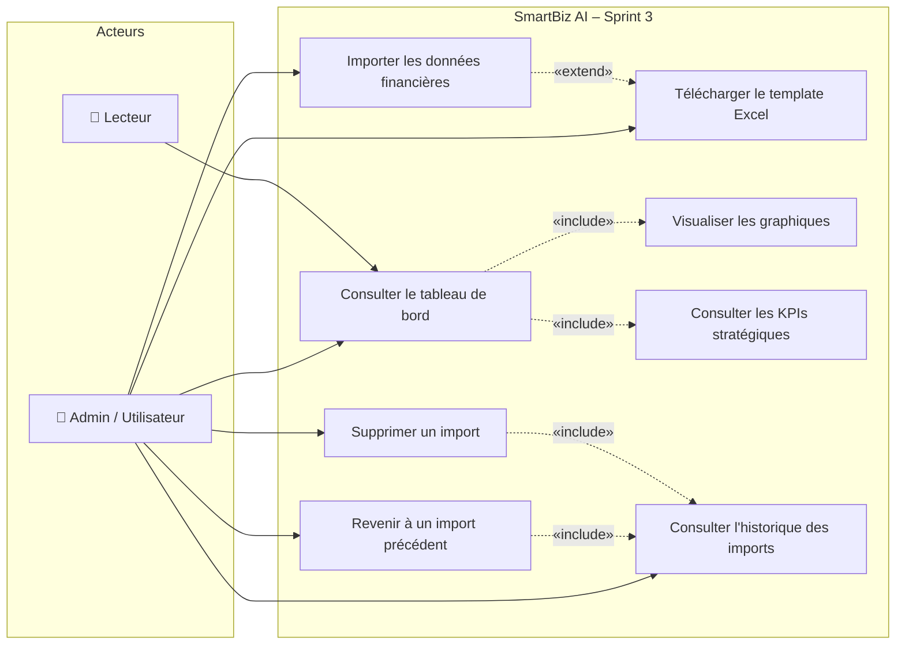
```mermaid
graph LR
    subgraph Acteurs
        AU["👤 Admin / Utilisateur"]
        RD["👤 Lecteur"]
    end

    subgraph "SmartBiz AI – Sprint 3"
        UC1["Télécharger le template Excel"]
        UC2["Importer les données financières"]
        UC3["Consulter le tableau de bord"]
        UC4["Visualiser les graphiques"]
        UC5["Consulter les KPIs stratégiques"]
        UC6["Consulter l'historique des imports"]
        UC7["Revenir à un import précédent"]
        UC8["Supprimer un import"]
    end

    AU --> UC1 & UC2 & UC3 & UC6 & UC7 & UC8
    RD --> UC3
    UC3 -.->|"«include»"| UC4
    UC3 -.->|"«include»"| UC5
    UC2 -.->|"«extend»"| UC1
    UC7 -.->|"«include»"| UC6
    UC8 -.->|"«include»"| UC6
```

**Figure 3.11** – Diagramme de cas d'utilisation – Sprint 3

#### Description des scénarios

**Cas d'utilisation « Importer les données financières »**

| Élément | Description |
|---|---|
| **Acteur principal** | Administrateur / Utilisateur |
| **Préconditions** | Authentifié (rôle ADMIN ou USER) ; entreprise avec secteur défini |
| **Postconditions** | un `ImportBatch` est créé avec macroFeatures, KPIs et N enregistrements `FinancialData` |

**Scénario nominal :**
1. L'utilisateur accède à `/import`
2. Il sélectionne un fichier Excel (`.xlsx`, max 10 Mo)
3. Le frontend envoie `POST /api/v1/financial/import` en `multipart/form-data` (protégé par `JwtAuthGuard + RolesGuard(ADMIN, USER)`)
4. Le `ParseFilePipe` valide la taille (≤ 10 Mo) et le type MIME
5. Le `FinancialService.processBimodalImport()` lit le workbook avec la librairie `xlsx`
6. Validation de la présence des 3 feuilles : `Valuation_Annual`, `CashFlow_Monthly_TTM`, `Strategic_KPIs`
7. **Feuille Strategic_KPIs** : parsing → validation via `StrategicKpiDto` (CAC, LTV, TAM, Market_Share, Employee_Count)
8. **Feuille Valuation_Annual** : parsing → injection auto du code SIC depuis le secteur de l'entreprise
9. Création de l'`ImportBatch` avec les KPIs et les `macroFeatures` (JSON)
10. **Feuille CashFlow_Monthly_TTM** : parsing ligne par ligne → validation via `FinancialRowDto` → préparation en bulk
11. Insertion en bulk des données (`createMany`) dans `FinancialData`
12. Le système retourne `{ success: true, batchId, recordsProcessed }`

**Scénarios alternatifs :**
- **4a.** Fichier trop gros ou mauvais format → Erreur de validation NestJS
- **6a.** Feuille manquante → `BadRequestException` « Missing required sheet: X »
- **7a.** KPI invalide → `BadRequestException` « Strategic KPIs sheet has invalid data format »
- **10a.** Données cash flow invalides → `BadRequestException` avec la métrique et la période en erreur
- **Toute erreur** → Rollback de la transaction Prisma (`$transaction`)

---

**Cas d'utilisation « Télécharger le template Excel »**

| Élément | Description |
|---|---|
| **Acteur principal** | Administrateur / Utilisateur |
| **Préconditions** | Authentifié |
| **Postconditions** | Un fichier `.xlsx` pré-formaté est téléchargé |

**Scénario nominal :**
1. L'utilisateur clique sur « Télécharger le template »
2. Le frontend déclenche `GET /api/v1/financial/template`
3. Le `FinancialService.generateTemplate()` crée un workbook avec 3 feuilles :
   - **Valuation_Annual** : 11 colonnes (Assets_N, Liabilities_N, Revenues_N, etc.)
   - **CashFlow_Monthly_TTM** : 8 métriques × 12 mois (colonnes dynamiques)
   - **Strategic_KPIs** : 5 colonnes (CAC, LTV, TAM, Market_Share, Employee_Count)
4. Le fichier est retourné en tant que `StreamableFile` avec les headers appropriés
5. Le navigateur télécharge le fichier `SmartBiz_Financial_Template.xlsx`

---

**Cas d'utilisation « Consulter le tableau de bord »**

| Élément | Description |
|---|---|
| **Acteur principal** | Administrateur / Utilisateur / Lecteur |
| **Préconditions** | Authentifié ; des données financières ont été importées |
| **Postconditions** | Les données sont affichées sous forme de graphiques interactifs |

**Scénario nominal :**
1. L'utilisateur accède à `/dashboard`
2. Le frontend appelle `GET /api/v1/financial/dashboard-metrics`
3. Le `FinancialService.getDashboardMetrics()` récupère le dernier `ImportBatch` avec ses `FinancialData`
4. Les données sont pivotées par période (`YYYY-MM`) : chaque objet contient toutes les métriques pour une période
5. Les KPIs stratégiques (CAC, LTV, TAM, Market_Share, Employee_Count) sont extraits du batch
6. Le frontend affiche les données dans des graphiques Recharts (lignes, barres) et des cartes KPI

**Scénarios alternatifs :**
- **3a.** Aucune donnée importée → `{ hasData: false }` → Le dashboard affiche un message invitant à importer

---

**Cas d'utilisation « Revenir à un import précédent »**

| Élément | Description |
|---|---|
| **Acteur principal** | Administrateur / Utilisateur |
| **Préconditions** | Authentifié ; au moins deux imports existent pour l'entreprise |
| **Postconditions** | Le dashboard est recalculé et affiché sur le batch sélectionné |

**Scénario nominal :**
1. L'utilisateur ouvre le panneau d'historique des imports depuis le dashboard
2. Le frontend appelle `GET /api/v1/financial/imports`
3. L'utilisateur sélectionne un batch antérieur
4. Le frontend appelle `GET /api/v1/financial/dashboard-metrics/:batchId`
5. Le backend retourne les KPIs et séries du batch sélectionné
6. Le dashboard s'actualise avec les données historiques

**Scénarios alternatifs :**
- **4a.** Batch introuvable ou appartenant à une autre entreprise → `NotFoundException`

---

**Cas d'utilisation « Supprimer un import »**

| Élément | Description |
|---|---|
| **Acteur principal** | Administrateur / Utilisateur |
| **Préconditions** | Authentifié ; un batch existe dans l'historique |
| **Postconditions** | Le batch et ses `FinancialData` sont supprimés ; l'historique et le dashboard sont mis à jour |

**Scénario nominal :**
1. L'utilisateur ouvre l'historique des imports
2. Il clique sur supprimer pour un batch donné
3. Le frontend appelle `DELETE /api/v1/financial/imports/:batchId`
4. Le backend valide la propriété du batch puis supprime en cascade les données liées
5. Le frontend recharge l'historique et le dashboard courant

**Scénarios alternatifs :**
- **4a.** Batch inexistant → `NotFoundException`
- **4b.** Suppression du batch actuellement affiché → bascule automatique vers le dernier batch disponible, sinon état `hasData: false`

---

### 3.4.4 Conception

#### Diagramme de classes – Sprint 3

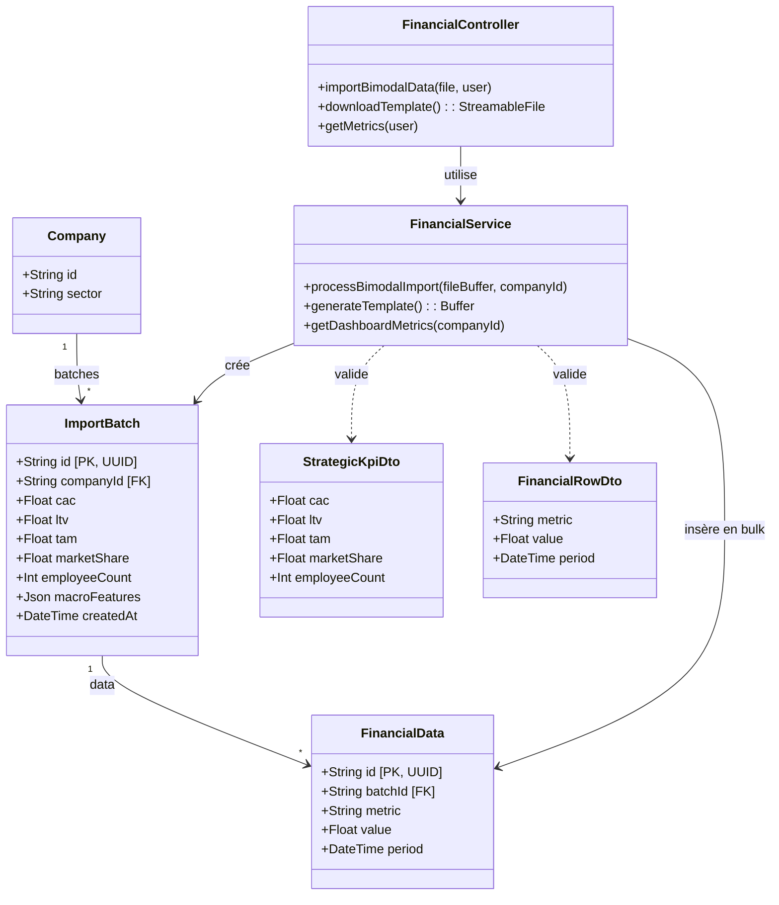
```mermaid
classDiagram
    class ImportBatch {
        +String id [PK, UUID]
        +String companyId [FK]
        +Float cac
        +Float ltv
        +Float tam
        +Float marketShare
        +Int employeeCount
        +Json macroFeatures
        +DateTime createdAt
    }

    class FinancialData {
        +String id [PK, UUID]
        +String batchId [FK]
        +String metric
        +Float value
        +DateTime period
    }

    class FinancialService {
        +processBimodalImport(fileBuffer, companyId)
        +generateTemplate(): Buffer
        +getDashboardMetrics(companyId)
    }

    class FinancialController {
        +importBimodalData(file, user)
        +downloadTemplate(): StreamableFile
        +getMetrics(user)
    }

    class StrategicKpiDto {
        +Float cac
        +Float ltv
        +Float tam
        +Float marketShare
        +Int employeeCount
    }

    class FinancialRowDto {
        +String metric
        +Float value
        +DateTime period
    }

    class Company {
        +String id
        +String sector
    }

    Company "1" --> "*" ImportBatch : batches
    ImportBatch "1" --> "*" FinancialData : data
    FinancialController --> FinancialService : utilise
    FinancialService ..> StrategicKpiDto : valide
    FinancialService ..> FinancialRowDto : valide
    FinancialService --> ImportBatch : crée
    FinancialService --> FinancialData : insère en bulk
```

**Figure 3.12** – Diagramme de classes – Sprint 3

#### Diagramme de séquence – Importer les données financières

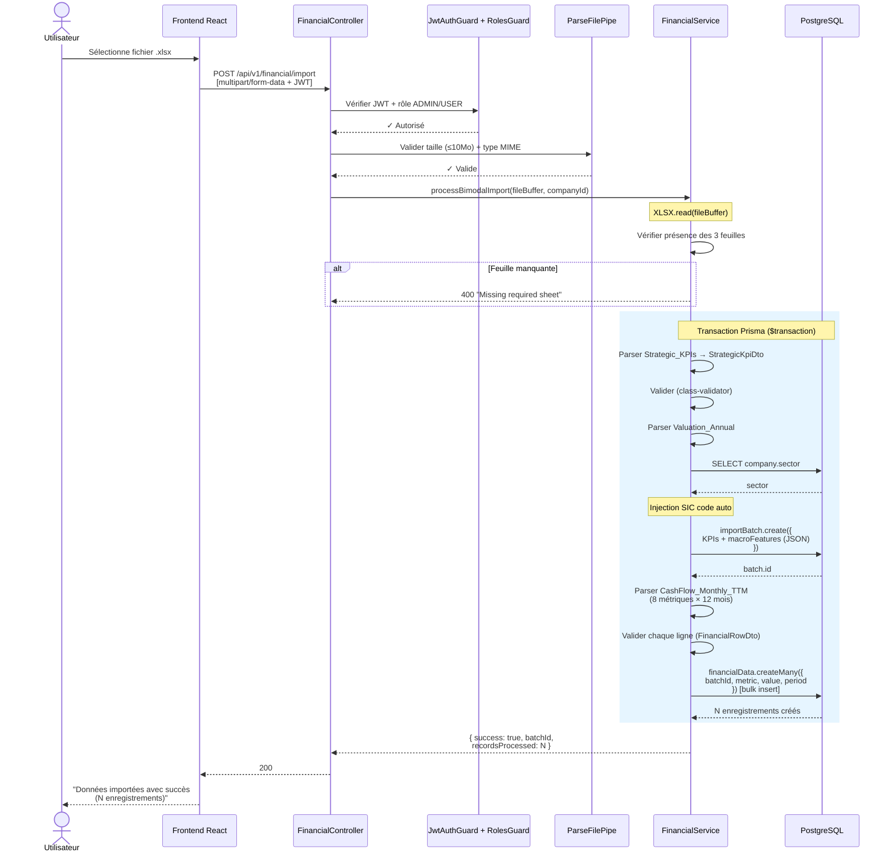
```mermaid
sequenceDiagram
    actor U as Utilisateur
    participant F as Frontend React
    participant B as FinancialController
    participant G as JwtAuthGuard + RolesGuard
    participant P as ParseFilePipe
    participant S as FinancialService
    participant DB as PostgreSQL

    U->>F: Sélectionne fichier .xlsx
    F->>B: POST /api/v1/financial/import<br/>[multipart/form-data + JWT]

    B->>G: Vérifier JWT + rôle ADMIN/USER
    G-->>B: ✓ Autorisé

    B->>P: Valider taille (≤10Mo) + type MIME
    P-->>B: ✓ Valide

    B->>S: processBimodalImport(fileBuffer, companyId)

    Note over S: XLSX.read(fileBuffer)

    S->>S: Vérifier présence des 3 feuilles
    
    alt Feuille manquante
        S-->>B: 400 "Missing required sheet"
    end

    rect rgb(230, 245, 255)
        Note over S,DB: Transaction Prisma ($transaction)

        S->>S: Parser Strategic_KPIs → StrategicKpiDto
        S->>S: Valider (class-validator)

        S->>S: Parser Valuation_Annual
        S->>DB: SELECT company.sector
        DB-->>S: sector
        Note over S: Injection SIC code auto

        S->>DB: importBatch.create({<br/>  KPIs + macroFeatures (JSON)<br/>})
        DB-->>S: batch.id

        S->>S: Parser CashFlow_Monthly_TTM<br/>(8 métriques × 12 mois)
        S->>S: Valider chaque ligne (FinancialRowDto)

        S->>DB: financialData.createMany({<br/>  batchId, metric, value, period<br/>}) [bulk insert]
        DB-->>S: N enregistrements créés
    end

    S-->>B: { success: true, batchId,<br/>recordsProcessed: N }
    B-->>F: 200
    F-->>U: "Données importées avec succès<br/>(N enregistrements)"
```

**Figure 3.13** – Diagramme de séquence – Import des données financières

#### Diagramme de séquence – Consulter le tableau de bord

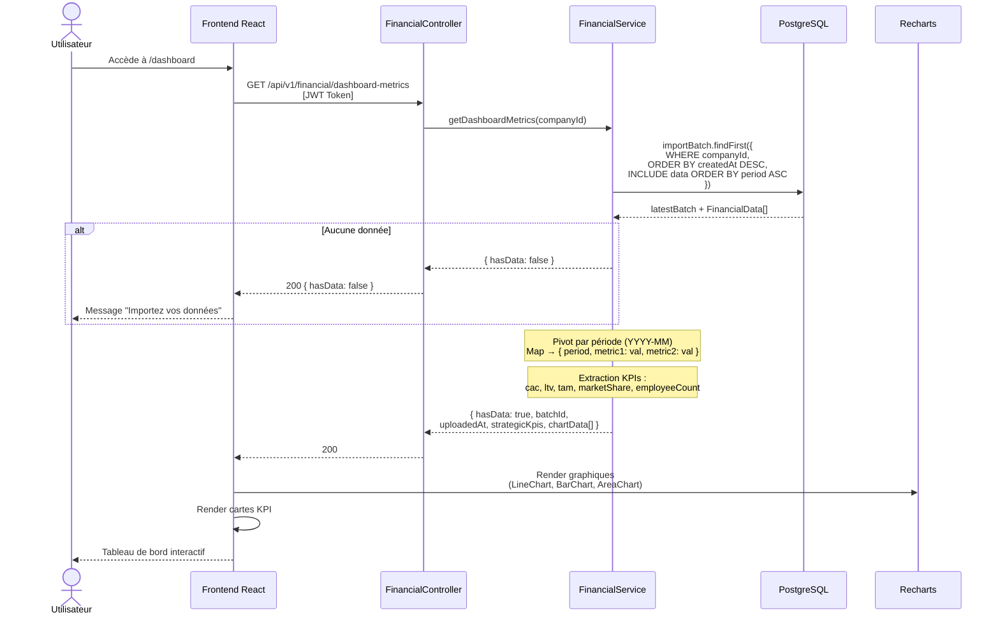
```mermaid
sequenceDiagram
    actor U as Utilisateur
    participant F as Frontend React
    participant B as FinancialController
    participant S as FinancialService
    participant DB as PostgreSQL
    participant R as Recharts

    U->>F: Accède à /dashboard
    F->>B: GET /api/v1/financial/dashboard-metrics<br/>[JWT Token]

    B->>S: getDashboardMetrics(companyId)
    S->>DB: importBatch.findFirst({<br/>  WHERE companyId,<br/>  ORDER BY createdAt DESC,<br/>  INCLUDE data ORDER BY period ASC<br/>})
    DB-->>S: latestBatch + FinancialData[]

    alt Aucune donnée
        S-->>B: { hasData: false }
        B-->>F: 200 { hasData: false }
        F-->>U: Message "Importez vos données"
    end

    Note over S: Pivot par période (YYYY-MM)<br/>Map → { period, metric1: val, metric2: val }

    Note over S: Extraction KPIs :<br/>cac, ltv, tam, marketShare, employeeCount

    S-->>B: { hasData: true, batchId,<br/>uploadedAt, strategicKpis, chartData[] }
    B-->>F: 200

    F->>R: Render graphiques<br/>(LineChart, BarChart, AreaChart)
    F->>F: Render cartes KPI
    F-->>U: Tableau de bord interactif
```

**Figure 3.14** – Diagramme de séquence – Tableau de bord

#### Diagramme de séquence – Télécharger le template

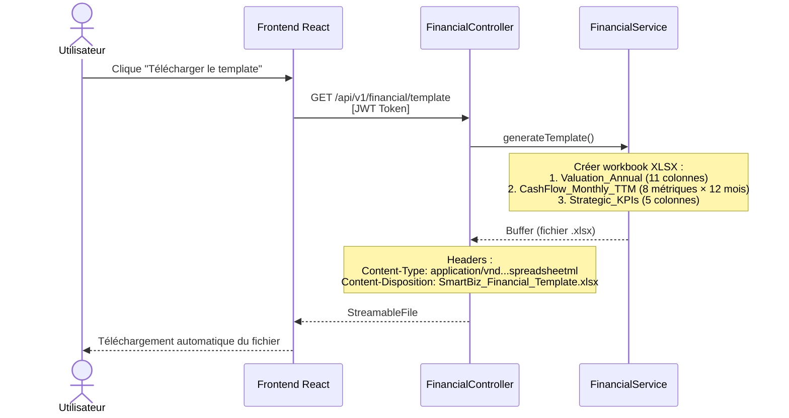
```mermaid
sequenceDiagram
    actor U as Utilisateur
    participant F as Frontend React
    participant B as FinancialController
    participant S as FinancialService

    U->>F: Clique "Télécharger le template"
    F->>B: GET /api/v1/financial/template<br/>[JWT Token]

    B->>S: generateTemplate()

    Note over S: Créer workbook XLSX :<br/>1. Valuation_Annual (11 colonnes)<br/>2. CashFlow_Monthly_TTM (8 métriques × 12 mois)<br/>3. Strategic_KPIs (5 colonnes)

    S-->>B: Buffer (fichier .xlsx)

    Note over B: Headers :<br/>Content-Type: application/vnd...spreadsheetml<br/>Content-Disposition: SmartBiz_Financial_Template.xlsx

    B-->>F: StreamableFile
    F-->>U: Téléchargement automatique du fichier
```

**Figure 3.15** – Diagramme de séquence – Téléchargement du template

### 3.4.5 Réalisation

> [!NOTE]
> Les captures d'écran des interfaces réalisées pour le Sprint 3 (ImportPage, Dashboard avec graphiques, KPIs) sont à insérer ici.

**Interfaces développées :**
- **Page Import** (`/import`) — Zone de drop/sélection de fichier, bouton de téléchargement du template, feedback d'import (succès / erreur avec détails)
- **Page Dashboard** (`/dashboard`) — Graphiques interactifs Recharts (revenus, dépenses, cash flow mensuels), cartes KPI stratégiques (CAC, LTV, TAM, Part de marché, Effectifs), date du dernier import
- **Historique des imports** (drawer) — Liste des imports avec date et volume, action de retour à un batch précédent, action de suppression d'un import
